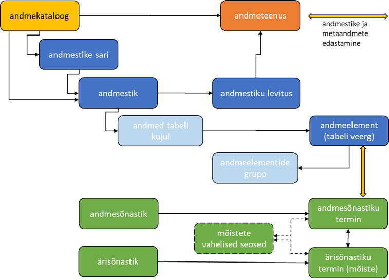
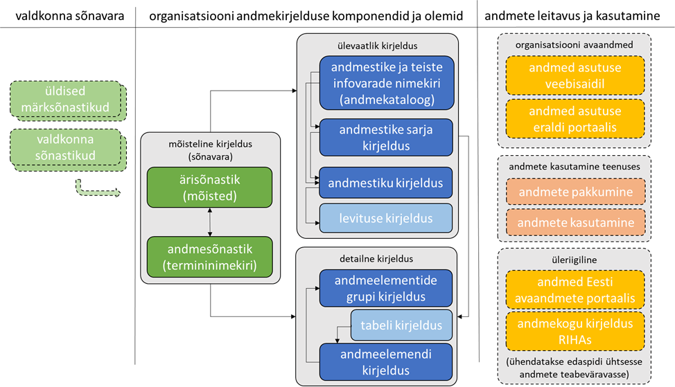

# Andmekirjelduse juhis. Lisa 1 andmekirjelduse standard
**Versioon 3.0.1**
**Aprill 2024**

---

## Kiirlingid
- **PDF kujul**: [AH Juhis Lisa 1](legacy/AH_juhis_andmekirjeldus_standard_3.0.1.pdf)
- **Eelmine versioon**: [Legacy 3.0.1](legacy/index.md)
- **Viimane mustandversioon**: [Latest editor's draft]()

## Tagasiside ja muudatusettepanekud
- **Soovitused ja parandused** esitada *GitHub Issues* kaudu.
- **Juhend issue loomiseks**: [Juhend](https://github.com/e-gov/Andmekirjelduse-Standard/wiki/Tagasiside-esitamine)
- **Link Issues lehele**: [Issues](https://github.com/e-gov/Andmekirjelduse-Standard/issues)

## Versioonihaldus
- **Selle väljalaske tag**: `v3.0.1`
- **Muutuste ajalugu**: [GitHub Commits](https://github.com/e-gov/Andmekirjelduse-Standard/commits)

## Autorid ja toimetajad
- Veiko Berendsen, Statistikaamet
- Kuldar Aas, Majandus- ja Kommunikatsiooniministeerium
- Annika Uibopuu, Statistikaamet

---

## Sisukord

  - [Lühendid](#lühendid)
  - [1. Sissejuhatus](#1-sissejuhatus)
  - [1.1 Eessõna](#11-eessõna)
  - [1.2 Käsitlusala](#12-käsitlusala)
  - [1.3 Kirjeldusstandardisse kuuluvate olemite ülevaade ja seosed](#13-kirjeldusstandardisse-kuuluvate-olemite-ülevaade-ja-seosed)
    - [1.3.1 Komponendid ja olemid](#131-komponendid-ja-olemid)
    - [1.3.2 Andmekataloog](#132-andmekataloog)
    - [1.3.3 Andmestike sari](#133-andmestike-sari)
    - [1.3.4 Andmestik](#134-andmestik)
    - [1.3.5 Alamandmestik](#135-alamandmestik)
    - [1.3.6 Levitus](#136-levitus)
    - [1.3.7 Andmetabel](#137-andmetabel)
    - [1.3.8 Andmeelement](#138-andmeelement)
    - [1.3.9 Andmeelementide grupp](#139-andmeelementide-grupp)
    - [1.3.10 Andmeteenus](#1310-andmeteenus)
    - [1.3.11 Andmesõnastik ja ärisõnastik](#1311-andmesõnastik-ja-ärisõnastik)
    - [1.3.12 Andmesõnastiku ja ärisõnastiku termin](#1312-andmesõnastiku-ja-ärisõnastiku-termin)
  - [1.4 Andmekirjelduse standardi kasutusjuhud](#14-andmekirjelduse-standardi-kasutusjuhud)
    - [1.4.1 Integreeriv lähenemine andmekirjeldusele](#141-integreeriv-lähenemine-andmekirjeldusele)
    - [1.4.2 Andmekirjeldus organisatsioonis kasutamiseks](#142-andmekirjeldus-organisatsioonis-kasutamiseks)
    - [1.4.3 Andmekirjeldus kirjelduste avaldamiseks ja edastamiseks](#143-andmekirjeldus-kirjelduste-avaldamiseks-ja-edastamiseks)
  - [2. Andmekataloogi ja selle olemite kirjelduselemendid](#2-andmekataloogi-ja-selle-olemite-kirjelduselemendid)
  - [2.1 Andmekataloogi kirjeldus](#21-andmekataloogi-kirjeldus)
  - [2.2 Andmestiku kirjeldus](#22-andmestiku-kirjeldus)
  - [2.3 Andmestiku levituse kirjeldus](#23-andmestiku-levituse-kirjeldus)
  - [2.4 Andmestike sarja kirjeldus](#24-andmestike-sarja-kirjeldus)
  - [2.5 Andmeteenuse kirjeldus](#25-andmeteenuse-kirjeldus)
  - [2.6 Andmebaasi tabeli kirjeldus](#26-andmebaasi-tabeli-kirjeldus)
  - [2.7 Andmeelemendi kirjeldus](#27-andmeelemendi-kirjeldus)
  - [2.8 Andmeelementide grupp](#28-andmeelementide-grupp)
  - [3. Sõnastikud](#3-sõnastikud)
  - [3.1 Andmesõnastiku kirjeldus](#31-andmesõnastiku-kirjeldus)
  - [3.2 Andmesõnastiku termini kirjeldus](#32-andmesõnastiku-termini-kirjeldus)
  - [3.3 Ärisõnastiku kirjeldus](#33-ärisõnastiku-kirjeldus)
  - [3.4 Ärisõnastiku termini kirjeldus](#34-ärisõnastiku-termini-kirjeldus)

---

## Lühendid

- DCAT – andmekataloogi sõnastik (*Data Catalog Vocabulary*), mis on W3C standard. 
- DCAT-AP – andmekataloogi sõnastiku rakendusprofiil (*Data Catalog Vocabulary Application Profile*) Euroopa Liidu riikide vahel andmestike ja andmeteenuste kirjelduste vahetamiseks.
- DGA – Euroopa Parlamendi ja nõukogu määrus (EL) 2022/868, 30. mai 2022, Euroopa  andmehalduse kohta ning millega muudetakse määrust (EL) 2018/1724 (andmehalduse määrus, *Data Governance Act*).
- HVD – väärtuslikud andmestikud (*high value datasets*) nagu need on määratletud Euroopa Liidu väärtuslike andmestike nimekirja rakendusmääruses ja mis käsitleb andmestikke valdkondi; neid nimetatakse ka kõrgväärtuslikud andmestikud.
- RIHA – riigi infosüsteemi haldussüsteemi käitlev rakendus.
- RIHAKE – asutustele loodud rakendus andmekirjelduste koostamiseks ja edastamiseks RIHAsse.
- ODD – Euroopa Parlamendi ja nõukogu direktiiv (EL) 2019/1024, 20. juuni 2019, avaandmete ja avaliku sektori valduses oleva teabe taaskasutamise kohta. 

---

## 1. Sissejuhatus

## 1.1 Eessõna

Käesolev andmekirjelduse juhise lisa 1 esitab andmekirjelduse standardi. Standard on loetelu kohustuslikest ja soovituslikest kirjelduselementidest, nende tähendusest näidetega ning tehnilistest ja semantilistest seostest. Standardi rakendamine organisatsioonis tagab andmekirjelduste kokkulepitud semantikaga masintöödeldavuse. Standard võimaldab liidestuste tegemist andmekirjelduste ja ka andmete vahetamiseks nii organisatsioonide vahel kui ka riigi keskselt hallatavate andmete valdkonna infosüsteemidega.[^1]

Andmekirjelduse standardi väljatöötamisel on võimalikult palju kasutatud rahvusvahelist praktikat ja taotletud sellega semantilist ühildumist. Peamiseks rahvusvaheliseks aluseks on andmekataloogi sõnastiku versioon 3.0[^2] ja selle rakendusprofiil DCAT-AP. Lähtutud on rakendusprofiili versioonist DCAT-AP 3.0.0.[^3]

Andmekataloogi sõnastiku DCAT paljud kirjelduselemendid on seotud kirjeldusstandardiga Dublin Core.[^4] Dublin Core on ka Eestis üle võetud rahvusvaheline standard üldiseks inforessursside kirjeldamiseks.[^5] Samuti toetavad nii Dublin Core kui DCAT lingitud andmete kasutuselevõttu. Rahvusvahelise praktika kasutamine võimaldab kirjeldusi vahetada rahvusvaheliselt ning vähendab standardi pikaajalise haldamise kulusid.

Sõnastike kirjelduselementide osas on arvestatud Eesti standardiks üle võetud rahvusvahelise standardiga ISO 25964 „Tesaurused ja nende koostalitusvõime teiste sõnastikega.“[^6] Seda eelkõige kasutatava terminoloogia osas.

[^1]: Avaliku sektori andmekogude osas on selleks infosüsteemiks [riigi infosüsteemi haldussüsteem](https://www.riha.ee/Avaleht) (RIHA). Avaandmete osas on selleks infosüsteemiks [Eesti avaandmete teabevärav](https://andmed.eesti.ee/)(andmed.eesti.ee). 
[^2]: [Data Catalog Vocabulary (DCAT) - Version 3](https://www.w3.org/TR/vocab-dcat-3/) (W3C Proposed Recommendation 13 June 2024)
[^3]: [DCAT Application Profile for data portals in Europe](https://interoperable-europe.ec.europa.eu/collection/semic-support-centre/solution/dcat-application-profile-data-portals-europe/release/300)(DCAT-AP 3.0.0)
[^4]: [Dublin Core Metadata Innovation (DCMI)](https://www.dublincore.org/)
[^5]: EVS-ISO 15836-1:2019 Informatsioon ja dokumentatsioon. Dublin Core’i metaandmeelemendid. Osa 1: Põhielemendid (kehtiv alates 15.05.2019) ja EVS-ISO 15836-2:2023 Osa 2: DCMI atribuudid ja klassid (kehtiv alates 02.05.2023).
[^6]: EVS-ISO 25964-1:2023 Informatsioon ja dokumentatsioon. Tesaurused ja nende koostalitusvõime teiste sõnastikega. Osa 1: Infootsingu tesaurused ja EVS-ISO 25964-2:2023 Informatsioon ja dokumentatsioon. Tesaurused ja nende koostalitusvõime teiste sõnastikega. Osa 2: Koostalitusvõime teiste sõnastikega (kehtiv alates 02.05.2023).

## 1.2 Käsitlusala

Standard käsitleb organisatsiooni andmestike kirjeldamise osasid: komponente ja olemeid.  

**Komponentidena** on käsitletud andmestiku kui terviku ülevaatlikku kirjeldust, andmestiku sisu detailset kirjeldust ning sõnastike osa kirjeldust ehk mõistelist kirjeldust, mis aitab hallata sõnavara. 

**Olemitena**  on käsitletud andmekirjelduse standardi eraldi hallatavaid ja kirjeldatavaid objekte, mis koos moodustavad mudeli.  

Standard on koostatud ühilduvana DCAT-AP 3.0.0-ga. See võimaldab organisatsioonidel andmekataloogis kirjeldada andmestikud ning nende levitused, rühmitada andmestikud sarjadesse. Standardis on samuti andmekataloogis kirjeldatud andmestike andmeteenuste osa. 

Standard käsitleb andmestiku struktuuri detailset sisemist kirjeldust. See on kitsendatud tabeli kirjeldusega, mis on kas nimekirja või risttabeli kujul.

## 1.3 Kirjeldusstandardisse kuuluvate olemite ülevaade ja seosed

### 1.3.1 Komponendid ja olemid

Kirjeldusstandardisse kuuluvad komponendid ja olemid on omavahel seotud. Olemite vahelised seosed on esitatud joonisel 1 ning moodustavad andmekirjelduse.[^7] Sellel on kujutatud, kuidas andmestikud ja nende sarjad on hierarhiliselt osad andmekataloogist. On näidatud, kuidas andmestik on kirjeldatav levitusena, mis on kasutatav andmeteenusena, mida saab edastada organisatsioonist välja ja mida saab pärida.[^8]

Andmestikud ja levitused on andmestruktuurid (üldiselt failid ja/või tabelid). Tabel või muu hästi struktureeritud andmete hulk koosneb andmeelementidest. Andmeelemendid on kirjeldatavad sõnastikes kui terminid ja mõisted. Andmeelemendid on ka grupeeritavad ning see andmeelementide grupp on ka eraldi hallatav. Nii andmetabel kui ka andmeelementide grupp on käsitletav andmeobjektina. Selline andmeobjekt luuakse kas arusaadavuse ehk andmete mõistmise parandamiseks või halduslikult seotud objektina nagu põhiandmete (master data) objekt või kui toimingu või teenuse kontekstis kokku kuuluv kirje (record).

*Joonis 1: Tervikliku andmekirjelduse koostamisel komponentide vahel toimivad seosed.*

Järgnevalt on esitatud kirjeldusstandardisse kuuluvate olemite lühikirjeldused ning kui need on seotud standardiga DCAT 3.0, siis olemi määratlused eesti ja inglise keeles. DCAT standard nimetab neid olemeid klassideks.

[^7]: Andmekirjelduse määratlus ja selle sisu kirjeldus on esitatud andmekirjelduse juhises.
[^8]: Andmeteenust on standardis käsitletud DCAT 3.0.0 määratletud tähenduses. Andmeteenus on operatsioonide kogum, mille abil antakse juurdepääs ühele või enamale andmestikule või andmetöötlusfunktsioonile. (A collection of operations that provides access to one or more datasets or data processing functions.)

### 1.3.2 Andmekataloog

Andmekataloog (Catalog) on nimekiri kataloogitud objektidest, mis andmehalduses on andmestikud ja mille kohta on kataloogis metaandmekirje. Andmekataloog võib ka toimida repositooriumina, millisel juhul on selles lisaks metaandmetele halduse all ka andmestikud ise.

Andmestikud võivad olla rühmitatud sarjadesse. Tavaliselt on organisatsioonil üks andmekataloog. Andmekataloog on vahend, mille abil saab muu hulgas hallata andmestike pealt osutatavaid andmeteenuseid.

**DCAT määratlus**
- Inforessursside hallatud metaandmete kogum.
- A curated collection of metadata about resources.

### 1.3.3 Andmestike sari

Andmestike sarja (Dataset Series) moodustavad mingi kindla rühmitamiskriteeriumi alusel kokku kuuluvad andmestikud. Andmestike esitamine andmekataloogis sarjades võimaldab ühelt poolt terve kataloogi jagada osadeks ja teiselt poolt rühmitada andmestikud. Tavalised rühmitamiskriteeriumid on: temaatiline, kronoloogiline, seotus teenuse või protsessiga. Harvemini on kriteeriumiteks aktiivne ja arhiivi osa ning faili vorming. Sarjade moodustamine ei ole kohustuslik, kuid kui sarjad on kasutusel, on need kohustuslik kirjeldada st koostada sarja metaandmekirje.

Sarja mõiste on kasutusel arhiivi- ja dokumendihalduses. Arhiivieeskirjas on punkt, mis ütleb, et sarja saab moodustada andmete kogumitest, mida saab identifitseerida ja koos hallata.[^9] Sarjade moodustamise põhimõtted andmekataloogis ja liigitusskeemis on andmestike sarjadena haldamist soodustavana kokkulangevad. Soovitav on organisatsioonis tekkivad andmestikud liigitada sarjadesse.

**DCAT määratlus**
- Eraldi avaldatav andmestike kogum, millel on mingid ühised tunnused, mille alusel need on rühmitatud.
- A collection of datasets that are published separately, but share some characteristics that group them.

[^9]: Arhiivieeskiri. (RT I, 19.06.2020, 4) § 7 Liigitusskeemi tasandid, lõige 4, punkt 1. Arhiivieeskirja seletuskirjast võib järeldada, et andmete kogumi all on silmas peetud sama, mida riikliku statistika seadus määratleb kui andmestikku. Seletuskirjas on: „Sarja moodustamise ühe tunnusena on lisatud „andmete kogum, mida saab identifitseerida ja koos hallata“. See annab selgema võimaluse andmekogudes oleva teabe liigitamiseks, soodustades sealhulgas ka säilitustähtaegade määramist mistahes andmetele, mida on mõistlik kogumina hallata. Kokkuvõtlikult märkides tähendab see sätte mõttes mistahes andmete kogumit, mida on mõistlik koos hallata (sama säilitustähtaeg, samad eraldamistoimingud hävitamiseks, samad juurdepääsutingimused ja muud võimalikud haldamistoimingud).“

### 1.3.4 Andmestik

Andmestik (Dataset) on terviklikult identifitseeritav ja hallatav andmete kogum.[^10] Andmestiku tüüpe on mitmesuguseid ning kataloogis on need kokku viidavad Dublin Core inforessursi tüüpidega.[^11] Dublin Core inforessursi tüüpide märksõnastikus on andmestik (dataset) üks märksõna. Praktikas on andmekataloogis enamasti andmestiku tüüpi inforessursid. See tähendab, et andmestik võib olla terve õiguslikult kehtestatud andmekogu või ka infosüsteem. Samas on võimalik nii andmekogusid kui infosüsteeme hallata sisuliselt või tehniliselt määratletud ja eristatavate osade kaupa, mida võib nimetada alamandmestikeks. Kui andmekogu kui andmestikku määravad kriteeriumid on peamiselt selle eraldi õiguslik olemasolu, siis paljud infosüsteemid, andmebaasid või nende osad on organisatsiooniliselt või tehniliselt hallatavad andmestikena ning samuti on avaandmete portaalides ja mujal andmestikeks teksti, pildi jms tüüpi andmestikud. 

**DCAT määratlus**
- Ühe isiku [või organisatsiooni] avaldatud või hallatud andmete kogum, mis on tehtud kättesaadavaks või alla laetavaks ühel või enamal esituskujul.
- A collection of data, published or curated by a single agent, and available for access or download in one or more representations.

[^10]: Põhjalikum andmestiku selgitus koos määratlustega on andmekirjelduse juhises.
[^11]: [DCMI Metadata Terms](https://www.dublincore.org/specifications/dublin-core/dcmi-terms/). Osa 7. DCMI Type Vocabulary

### 1.3.5 Alamandmestik

Alamandmestik on objektitüübina sarnane andmestikuga. Vajadus alamandmetiku eristamiseks tuleneb sellest, et andmekogudes (infosüsteemides, andmebaasides) on loogiliselt või tehniliselt eristuvad osad, mida on otstarbekas hallata eraldi. Need võivad olla hulk tabeleid või terve skeem relatsioonilises andmebaasis.

DCATis alamandmestiku klassi ei ole. Käesolevasse standardisse on see lisatud andmekogude (andmebaaside) loogilise või füüsilise haldamise lihtsustamise jaoks ehk konkreetselt selleks, kuidas on otstarbekas luua seos andmekataloogi ja andmebaasi osa vahel ja seda hallata. Osalt tuleneb vajadus ka sellest, et õiguslikult reguleeritud andmekogu, see tähendab andmete struktuur, mille kohta on andmekogu põhimäärus, võib mõnel juhul sisaldada tegelikult üsna eraldi ’töötavaid’ osasid. Just selliseid osasid ongi praktikas otstarbekas hallata kui alamandmestikke.

### 1.3.6 Levitus

Levitus (Distribution) on andmestiku salvestamiseks või edastamiseks tehtav andmete tehniline esitus, konkreetseks kasutusjuhuks mõeldud andmestiku terviklik või osaline väljavõte või kasutusmeetod. Levitus võib olla näiteks fail, tabel või teenus. Sageli ongi tegemist eri vormingutes ettevalmistatud failidega.

Levituse kirjeldamisel lähtutakse standardi DCAT 3.0 versioonist. Levituse kirjeldus võimaldab edasi anda täpsemat teavet andmestiku vormingu ja taaskasutamise tingimuste kohta. Levitus on DCATis rangelt eraldi olemina, millele saab kirjeldada pealkirja (title) nagu see on andmestikul. Eesti andmekirjelduse standardis käsitletakse levitust seotuna andmestikuga. Andmestikus on selleks kirjelduselement, mis viitab levitusele. Andmehalduse määruse ja väärtuslike andmetike rakendusmääruse skoobis olevate andmestike kirjeldamisel on kohustuslik vähemalt ühe levituse kirjeldamine.

**DCAT määratlus**
- Andmestiku kindlakujuline esitus. Andmestik võib olla kättesaadav mitmel erineval serialiseeritud kujul, nagu loomulikus keeles, meedia tüübis või vormingus, organiseerituna skeemi, ajalises ulatuses või ruumilises resolutsioonis, detailsuses või profiilis (mida saab täpsustada).[^12]

- A specific representation of a dataset. A dataset might be available in multiple serializations that may differ in various ways, including natural language, media-type or format, schematic organization, temporal and spatial resolution, level of detail or profiles (which might specify any or all of the above).

[^12]: Serialiseerimise all tuleb selles kontekstis mõista eelkõige andmestruktuuride või -objektide teisendamist kitsas tehnilises tähenduses mingisse vormingusse, et need andmed oleks salvestatavad failina või edastatavad erinevates võrkudes.

### 1.3.7 Andmetabel

Tabel on info esitamine ridade ja veergudena.[^13] Selle objektitüübi eraldi välja toomine mudelis ning seeläbi ka sellele eraldi kirjelduse tegemine on vajalik relatsiooniliste andmebaaside kirjeldamise kontekstis, mis koosnevad tabelitest. Andmetabel on selles mudelis esmajoones andmebaasi tabel, mis on andmekirjelduse detailse kirjelduse komponendi juures üks grupeeriv olem. Tabel seob veerud, mis on kirjeldatava relatsioonilise andmebaasi andmeelemendid.

Objektitüüpi andmed tabeli kujul ei tohi segi ajada tabeliga, mida käsitletakse kui eraldi andmestikku või levitust. Andmekirjelduste koostamisel on vaja arvestada tabeli kahetise tähendusega, milleks on tabel kui eraldi hallatav andmestik ja tabel relatsioonilises andmebaasis.

[^13]: Põhjalikum andmetabeli selgitus on andmekirjelduse juhises.

### 1.3.8 Andmeelement

Andmeelemendi kirjelduse moodustavad selle detailsed kirjelduselemendid. Andmeelemendi kirjeldus võimaldab aru saada elemendi tähendusest ja seostest teiste andmeelementidega.

Standardis toodud andmeelemendi kirjeldus on eelkõige mõeldud selleks, et relatsioonilise andmebaasi tabelite veerge oleks võimalik kirjeldada andmeelementidena ning moodustada kirjeldatud andmeelemendist andmesõnastiku kirje, nii et kirjeldatud andmeelementidest moodustub andmesõnastik. Andmeelementidest komplektide moodustamiseks on standardis eraldi olem andmeelementide grupp.

Standardis on kirjelduselemendid esitatud andmekataloogi vaatest eesmärgiga andmeelemendid identifitseerida, neid omavahel seostada ning siduda andmesõnastikuga. Organisatsioonis juba kasutusel olev andmeelementide kirjeldus võib seega olla osaks loodavast andmekataloogist. Andmekataloogis võib kirjeldus sisaldada põhjalikumat teavet andmeelemendi tehnilise realisatsiooni, seotuse kohta ärireeglitega ja andmekvaliteedinõuete kohta (korduvus, kohustuslikkus, vaikeväärtused, täitmise reeglid jt).

### 1.3.9 Andmeelementide grupp

Andmeelementide grupi moodustavad sisuliselt seotud andmeelemendid. Tavaliselt on normaalkujule viidud relatsioonilises andmebaasis sisuliselt grupeeruvad elemendid eraldi tabelites. Vajadus andmeelemente grupeerida tuleneb vajadusest mõista sisuliselt kokku kuuluvaid, kuid tehniliselt laiali olevate andmeelementide tähendust. Ei ole aga ka välistatud juhud, kus tabeli moodustavadki grupeeruvad andmeeleemendid. Näiteks on koha-aadress eraldi tabelis.

Tehniliselt on relatsioonilises andmebaasis loogilist kirjet moodustavad tunnused tavaliselt eri veergudes. Samas kirje võib olla ühe või mitme objekti ja toimunud sündmuse kohta. Näiteks lapse sünnil on ema ja laps oma tunnustega ning mitmesugused sünniga seotud tunnused. Need moodustavad loomulikke ja koos kasutatavaid või ainult koos sisulist tähendust omavaid gruppe.

Lisaks eksisteerib olukordi, kus ei ole lubatud avalikustada detailseid andmekirjeldusi andmeelementide tasemel, kuid on lubatud seda teha grupeeritud tasemel. Samuti on sageli otstarbekas siduda ärimõisteid andmeelementide grupiga. Näiteks sama sünni näite korral on üks isik ’rollis’ ema ja teine ’rollis’ laps. Kindlas kontekstis võib andmeelement ja andmesõnastiku termin näiteks olla: ’ema kaal enne rasedust’, mis on üks andmeelement grupis ’rasedusjärgne jälgimine’.

### 1.3.10 Andmeteenus

Standard käsitleb andmeteenust DCAT 3.0 versiooni kontekstis. Andmeteenusel puudub ühene seos avaliku sektori asutuste muude teenuse käsitlustega. Tegemist on andmekataloogi pealt, mis ei ole teenuste kataloog, osutatava teenusega, kasutades andmestikke. Samas võivad andmekataloogis loetletud teenused olla seotud muude teenustega. Muude teenuste all on silmas peetud digi- ja muid avalikke teenuseid nagu otsene või tugiteenus (TKTA teenused[^14]), samuti planeerimis- ja finantsvaate teenuseid (TERE teenused[^15]) kui ka tehnilised teenused (X-tee teenused[^16]).

Andmeteenuste kirjeldus on kuvatav kataloogis teenuste nimekirjana ning teenus on seotud andmestiku ja selle levitustega.

**DCAT määratlus**
- Operatsioonide kogum, mis võimaldab juurdepääsu ühele või enamale andmestikule või andmetöötlusfunktsioonile
- A collection of operations that provides access to one or more datasets or data processing functions.

[^14]: Avalike digiteenuste disainimise tööriistakast. [Avalike teenuste kataloog](https://digiriik.eesti.ee/juhend/avalike-teenuste-kataloog)
[^15]: Tegevuspõhise eelarvestamise käsiraamat. [4.3.5. Teenused](https://www.fin.ee/riigi-rahandus-ja-maksud/riigieelarve-ja-eelarvestrateegia/tegevuspohise-eelarvestamise-kasiraamat/teenused)
[^16]: [X-tee alamsüsteemide kataloog teenuste ja WSDL kirjeldustega](https://x-tee.ee/catalogue/EE)

### 1.3.11 Andmesõnastik ja ärisõnastik

Standardi teiseks komponendiks on sõnastikud, mida on kahte tüüpi: andmesõnastik ja ärisõnastik.[^17] Sõnastikud on oluline semantilise veebi komponent. Sõnastike olulisus seisneb peamiselt selles, et need muudavad nii tehnilistele kui mittetehnilistele töötajatele andmed arusaadavaks ja kasutatavaks. Teisisõnu aitavad need andmeid linkida ja taaskasutada.

Andmesõnastik on ühelt poolt terminite nimekiri ning teiselt poolt esitab terminitena andmeelementide nimetused (pealkirjad).

Ärisõnastik, mis esitab valdkonnas või organisatsioonis kasutatavad mõisted ning nende tähistamiseks kasutatavad sõnad ehk terminid ja võimaldab mõistelist arusaamist kasutatavast sõnavarast. Ärisõnastik on organisatsiooni või organisatsioonide üleselt kokku lepitud sõnavara, mida ohjatakse.

Sõnavara ohjamine (vocabulary control)[^18] tähendab seda, et mõisted, eriti põhimõisted, peaksid olema terminoloogiliselt kokku lepitud ja sisuliselt määratletud. Sageli on vajalik, et ärisõnastik oleks mitmekeelne. Ärisõnastikke võib asutusel olla üks või mitu. Ärisõnastik võib pärida termineid ja mõistete määratlusi valdkonna sõnastikest, terministandarditest või üldistest märksõnastikest, kui viimased on olemas.

[^17]: Põhjalikum sõnastike selgitus on andmekirjelduse juhises.
[^18]: Ohjatav ehk kontrollitud sõnavara (vocabulary control) moodustab märksõnastiku (controlled vocabulary). EVS-ISO 25964-1:2023 määratleb (2.12), et märksõnastik ehk kontrollitud märksõnastik on mõisteid tähistavate terminite, märksõnade või koodide ettekirjutatud loetelu.

### 1.3.12 Andmesõnastiku ja ärisõnastiku termin

Sõnastikud koosnevad terminitest. Terminid on mõistete sõnalised esitused. Harvem võivad terminid olla ka lühendid, sõned või muud märgid.

Andmesõnastiku termin on sõna või fraas, mis võib olla kindla määratlusega ja kindlast terminiallikast või ka mingi üldkeele sõna, millel definitsioon puudub. Kui definitsioon puudub või on tegu sõna või fraasiga, mida pole mõistlik määratleda, võib sel olla sõnaseletus.

Andmeelement võib olla tähistatud tähendust omava ja arusaadava sõnaga, aga võib olla ka akronüüm, lühend või muu sõne, mis on masinloetav, kuid pole lisaselgitusteta mõistetav. Andmeelemendi tähis on sageli andmemudelis ning võib seetõttu olla inglise keelne. Lisaks tähisele on andmeelemendil kirjeldus, mille aluseks on andmemudel ja mis sageli on andmebaasis andmeelemendi kommentaarina. Praktiline on teha andmeelementidele nimetused (pealkirjad) ning esitata need andmesõnastiku terminitena. Andmesõnastiku terminile lisatakse vajadusel määratlus või selgitus. Andmeelemendi kirjeldus võib sisaldada sõnu, millest andmesõnastiku termin moodustub. Andmesõnastiku terminid on soovitatav luua konteksti avavalt, mis tähendab, et need on pigem liitterminid või terved terminifraasid. Andmesõnastiku terminites kajastuvad mõisted, mille kohta need terminid käivad.

Ärisõnastiku terminid esitavad mingi valdkonna, andmekogu, laiema protsessi (teenuse) ja harvem andmestike sarja või andmestiku oskussõnavara. Oskussõnavara esitamine andmestiku kirjelduses on tavalisem siis, kui tegemist on uuringut, analüüsi või statistikat esitava andmestikuga, kus tunnused (andmeelemendid) esitavad kindlate definitsioonidega näitajaid, arvandmeid, muutujaid.

Ärisõnastik on mõistete ja terminite kogum, mida kasutatakse asutuses igapäevaselt rääkides või mis on kasutusel õigusaktides või tehnoloogias. Ärisõnastik peaks olema organisatsiooni tegevuste ja andmete kohta piisavalt täielik. Samas peaks see olema mõisteid piisavalt üldistav (laiemad ja grupeerivad mõisted) ja detailiseeriv (kitsamad ja seotud mõisted) ning lisaks veel ohjama sõnavara.

## 1.4 Andmekirjelduse standardi kasutusjuhud

### 1.4.1 Integreeriv lähenemine andmekirjeldusele

Tervikliku või ka osalise andmekirjelduse koostamine, ajakohasena hoidmine, et see oleks kasutatav usaldusväärse allikana andmete leidmiseks, arusaamiseks ja kasutamiseks, on töömahukas. Selle tõttu on eriti oluline integreeriv lähenemine. See tähendab, et standardile vastavad kirjeldused tehtaks õigel ajal ja õiges kohas. Selliselt on ühekordne kirjeldamine taaskasutatav. Andmekirjelduse tuuma ja selgroo moodustab andmekataloog ja sellesse kataloogitud andmestikud. Neile luuakse ülevaatlik kirjeldus ning kui andmestikke kirjeldatakse sisuliselt, siis detailne kirjeldus. Semantilise komponendina on kirjelduse osaks sõnastikud. Sõnastikel võib olla terminiallikaid väljaspool organisatsiooni, kust on võimalik pärida valdkonna sõnavara.

*Joonis 2: Standardi käsitlusalas olevad andmekirjelduse komponendid ja olemid*

Integreeritud lähenemine võimaldab andmeid leida ja kasutada nii organisatsiooni sees kui kuvada või edastada andmekirjeldust, mõnikord koos andmetega, organisatsioonist välja.

### 1.4.2 Andmekirjeldus organisatsioonis kasutamiseks

Standardi peamiseks kasutusjuhuks on organisatsioonis andmekirjelduse koostamine enda tarbeks, et oleks parem ja selgem arusaam, mis andmed organisatsioonil on.

Organisatsiooni sees omakorda võib eristada mitmeid kasutusjuhtusid:
- Osa organisatsiooni teabe (info) tervikülevaatest, mis on andmekataloog, kus sarjadesse rühmitatud andmestikud on osa organisatsiooni teabe ja dokumentide liigitusskeemist.
- Omaette vaade andmete leidmiseks ja kasutamiseks, milleks on andmekirjeldus esitatud andmekataloogi kujul. Selle alla võib lugeda ka andmete ettevalmistamise nende avaandmetena avaldamiseks.
- Kasutamine organisatsiooni sees osana protsessist (ETL) või teenusest, kus andmetöötluse sisu on pigem üksikandmete (ühe kirje) edastamine teenusejuhtumi käigus.
- Kasutamine organisatsioonis aruande, statistika või muu infot koondava andmetöötluse tarbeks. Sellise töötluse osaks võib olla andmete edastamine andmelattu või muusse andmestruktuuri.

### 1.4.3 Andmekirjeldus kirjelduste avaldamiseks ja edastamiseks

Teise olulise rühma andmekirjelduse standardi kasutusjuhtudest moodustavad kirjelduste kasutamised edastamiseks organisatsioonist välja või kättesaadavaks tegemised organisatsiooni  portaalides. Andmekirjeldusi võib edastada  ainult kui metaandmeid ja sel juhul on andmestikule viide kui juurdepääsukohale. Samuti on võimalik, et metaandmed edastatakse koos andmestikuga.

Erilisel kohal on avaandmetena avaldamine. DCAT standardi kasutamine kirjelduste koostamise alusena on paljus tõukunud avaandmete eesmärgist ja kohustusest. See on aga seotud teiste kasutusjuhtudega, kui andmeid või andmekirjeldusi avaldatakse.

Andmekirjelduste edastamiseks organisatsioonist välja või organisatsiooni portaalis võib eristada mitmeid kasutusjuhtusid:
- Paljud organisatsioonid on loonud oma avaandmete portaalid, milles avaldavad andmestikke kas aruannete või statistikana või pakuvad juurdepääsu oma avaandmetele teenuste kaudu. Sellistes portaalides tehtud avaldamised peaks kasutama selles andmekirjelduse standardis esitatud kirjeldusstruktuure ja -elemente.

- Kuna andmestiku tasandi kirjeldus on loodud DCAT-AP-ga ühilduvana, siis võimaldab see vahetada – kasutades näiteks OAI-PMH andmevahetusprotokolli[^19] – andmeid Euroopa avaandmete portaaliga.[^20]

[^19]: [Open Archives Initiative Protocol for Metadata Harvesting](https://www.openarchives.org/pmh/)
[^20]: [European data](https://data.europa.eu/en)

---

## 2. Andmekataloogi ja selle olemite kirjelduselemendid

Kirjeldused põhinevad suures osas standardi DCAT-AP 3.0.0 versioonil. Lisatud on kirjelduselemendid, mis arvestavad riigi kesksete andmehaldust toetavate rakenduste nõuetega, milleks on RIHA, Eesti avaandmete teabevärav ja RIHAKE. Ära on jäetud andmekataloogi kirje (Catalog record) olem, mis ei ole Eestis kasutusel. Elemendid on järjestatud olemites alfabeetiliselt v.a juhul, kui olemil on alamelemente.

---

## 2.1 Andmekataloogi kirjeldus

- [**DCAT Viide**](https://www.w3.org/TR/vocab-dcat-3/#Class:Catalog)
- **Atribuudid**
    - Selles klassis esinevad järgmised atribuudid: *[kirjeldus](#211-kirjeldus), [omanik](#212-omanik), [pealkiri](#213-pealkiri), [veebisait](#214-veebisait)*

---

| Atribuut | Vahemik | Kardinaalsus | Definitsioon |
|---|---|---:|---|
| **kirjeldus** | [Literal](https://www.w3.org/2000/01/rdf-schema#Literal) | 1..1 | Kataloogi sisuline lühikirjeldus. Peaks iseloomustama andmestikke, mida kataloog sisaldab. |
!!! example "Näide"
    Ruumiandmete lehelt leiad Maa-ameti ruumiandmete kirjeldused.

---

| Atribuut | Vahemik | Kardinaalsus | Definitsioon |
|---|---|---:|---|
| **omanik** | [Agent](https://semiceu.github.io/DCAT-AP/releases/3.0.0/#Agent) | 1..1 | Organisatsiooni nimetus, kes kataloogi peab. |
!!! example "Näide"
    - Statistikaamet  
    - Maksu- ja Tolliamet

---

| Atribuut | Vahemik | Kardinaalsus | Definitsioon |
|---|---|---:|---|
| **pealkiri** | [Literal](https://www.w3.org/2000/01/rdf-schema#Literal) | 1..1 | Kataloogi nimetus või tähis. |
!!! example "Näide"
    - (Statistikaamet) Statistika andmebaas  
    - (Maksu- ja Tolliamet) Statistika ja avaandmed

---

| Atribuut | Vahemik | Kardinaalsus | Definitsioon |
|---|---|---:|---|
| **veebisait** | [Document](https://semiceu.github.io/DCAT-AP/releases/3.0.0/#Document) | 0..1 | Viide veebisaidile, millel kataloog on juurdepääsetav. |
!!! example "Näide"
    https://andmed.stat.ee/

---

## 2.2 Andmestiku kirjeldus

- [**DCAT Viide**](https://www.w3.org/TR/vocab-dcat-3/#Class:Dataset)
- **Atribuudid**
    - Selles klassis esinevad järgmised atribuudid: *[andmestiku identifikaator](#221-andmestiku-identifikaator), [andmete piirdaatumid](#222-andmete-piirdaatumid), [andmete uuendamise regulaarsus](#223-andmete-uuendamise-regulaarsus), [andmestiku seos teise andmestikuga](#224-andmestiku-seos-teise-andmestikuga), [seotud andmestiku identifikaator](#2241-seotud-andmestiku-identifikaator), [seose tüüp](#2242-seose-tuup), [andmesõnastiku nimi](#225-andmesonastiku-nimi), [andmete päritolu](#226-andmete-paritolu), [päritolu andmestiku pealkiri](#2261-paritolu-andmestiku-pealkiri), [päritolu andmestiku URI](#2262-paritolu-andmestiku-uri), [geograafiline kaetus](#227-geograafiline-kaetus), [asukoha nimetus](#2271-asukoha-nimetus), [asukoha koordinaadid](#2272-asukoha-koordinaadid), [avalikustamise kuupäev](#228-avalikustamise-kuupaev), [HVD kategooria](#229-hvd-kategooria), [juurdepääsutase](#2210-juurdepaasutase), [kasutusele võtmise kuupäev](#2211-kasutusele-votmise-kuupaev), [keel](#2212-keel), [kirjeldus](#2213-kirjeldus), [kirjelduse muutmiskuupäev](#2214-kirjelduse-muutmiskuupaev), [kohalduvad õigusaktid](#2215-kohalduvad-oigusaktid), [kontaktpunkt](#2216-kontaktpunkt), [kontakti nimi](#22161-kontakti-nimi), [kontakti e-posti aadress](#22162-kontakti-e-posti-aadress), [kontakti telefoninumber](#22163-kontakti-telefoninumber), [levituse identifikaator](#2217-levituse-identifikaator), [lühinimetus](#2218-luhinimetus), [muu identifikaator](#2219-muu-identifikaator), [muu identifikaatori tüüp](#22191-muu-identifikaatori-tuup), [muu identifikaatori väärtus](#22192-muu-identifikaatori-vaartus), [märksõna](#2220-marksona), [märksõna termin](#22201-marksona-termin), [märksõna URI](#22202-marksona-uri), [omanik](#2221-omanik), [pealkiri](#2222-pealkiri), [seotud tegevused](#2223-seotud-tegevused), [tüüp](#2224-tuup), [valdkond](#2225-valdkond), [ainevaldkond](#22251-ainevaldkond), [valdkonna URI](#22252-valdkonna-uri), [vastab standardile](#2226-vastab-standardile), [veebisait](#2227-veebisait), [õiguslik alus](#2228-oiguslik-alus), [õigusakti nimetus](#22281-oigusakti-nimetus), [õigusakti link](#22282-oigusakti-link)*

---

| Atribuut | Vahemik | Kardinaalsus | Definitsioon |
|---|---|---:|---|
| **andmestiku identifikaator** | [Document](https://semiceu.github.io/DCAT-AP/releases/3.0.0/#Document) | 1..1 | Andmestikule omistatud unikaalne ja püsiv identifikaator. Identifikaatori võib omistada alliksüsteem või sihtsüsteem, näiteks Eesti andmete teabevärav. |

!!! example "Näide"
    28289ed9-8472-44c4-958b-91cef59eaada  
    Selgitus: on GUID kujul ning seda võib kasutada URI osana

---

| Atribuut | Vahemik | Kardinaalsus | Definitsioon |
|---|---|---:|---|
| **andmete piirdaatumid** | [Period of time](https://semiceu.github.io/DCAT-AP/releases/3.0.0/#Periodoftime) | 0..1 | Ajavahemik, mille kohta on andmed olemas ja/või avaldatud. Kuupäev esitatakse ISO 8601-1 vormingus (AAAA-KK-PP/AAAA-KK-PP). **Märkus** 1: andmete piirdaatumeid ei tohi segi ajada andmekogumise või -sisestamise piirdaatumitega, samuti andmestiku kasutusele võtmise kuupäevaga. **Märkus** 2: algusdaatumiks arvatakse kirje tegemise (dokumenteerimise) fakti või aega, mitte seotud aeg minevikust (näiteks hoone ehitamine aastal 1882). Lõppdaatumi märkimine on võimalik ja tarvilik ainult lõpetatud andmestike kirjeldamisel. |

!!! example "Näide"
    1993-11-05/2007-06-30  
    Selgitus: Andmestik katab sisus perioodi 1993-11-05/2007-06-30, mis on kohane ka piirdaatumitena märkimiseks, kuigi andmete avalikustamine toimus alles aastal 2003.

---

| Atribuut | Vahemik | Kardinaalsus | Definitsioon |
|---|---|---:|---|
| **andmete uuendamise regulaarsus** | [Frequency](https://semiceu.github.io/DCAT-AP/releases/3.0.0/#Frequency) | 0..1 | Andmestiku andmete uuendamise regulaarsus. Kirjelduselemendi väärtused võetakse ELi sageduste sõnastikust (EU Frequency Vocabulary)[^21]. Täita juhul, kui andmete kogumine või loomine ei toimu pidevalt, vaid perioodiliselt. |

!!! example "Näide"
    Kord aastas

---

| Atribuut | Vahemik | Kardinaalsus | Definitsioon |
|---|---|---:|---|
| **andmestiku seos teise andmestikuga** | - | 0..n | Teave kirjeldatava andmestikuga hierarhiliselt või ajaliselt seotud teiste andmestike kohta. |

!!! example "Näide"
    b49f330-e207-430e-87dd-ca8d5859438b; isPartOf  
    Selgitus: kirjeldatav andmestik “Riigikogu valimiste andmed” on osa (isPartOf) andmestikust “Valimiste andmed” (identifikaatoriga: 8b49f330-e207-430e-87dd-ca8d5859438b)

---

| Atribuut | Vahemik | Kardinaalsus | Definitsioon |
|---|---|---:|---|
| **seotud andmestiku identifikaator** | - | 1..1 | Andmestikuga seotud teise andmestiku identifikaator. |

!!! example "Näide"
    8b49f330-e207-430e-87dd-ca8d5859438b

---

| Atribuut | Vahemik | Kardinaalsus | Definitsioon |
|---|---|---:|---|
| **seose tüüp** | - | 1..1 | Andmestike vahelise seose tüüp Dublin Core seoste klassifikaatori alusel. Täpsemalt on Eesti andmekirjelduse standardis kasutusel neli seose tüüpi: isPartOf; hasPart; replaces; isReplacedBy. |

!!! example "Näide"
    Selgitus: isPartOf ja hasPart on kasutusel andmestiku ja alamandmestiku juures.  
    Selgitus: replaces ja isReplacedBy on kasutusel juhul kui tegemist on n-ö versioneeritavate andmestikega.

---

| Atribuut | Vahemik | Kardinaalsus | Definitsioon |
|---|---|---:|---|
| **andmesõnastiku nimi** | - | 1..1 | Sõnastiku pealkiri. Soovitatav on andmesõnastiku pealkirjas kasutada sõnastikule vastava andmestiku ja selle domeeni nimetusi. **Märkus**: RIHAKEses on kasutusel “Nimetus“. |

!!! example "Näide"
    Loomeliitude andmekogu (LLA) andmesõnastik

---

| Atribuut | Vahemik | Kardinaalsus | Definitsioon |
|---|---|---:|---|
| **andmete päritolu** | - | 0..n | Teise andmestiku pealkiri, mida on kasutatud kirjeldatava andmestiku loomiseks ja/või täiendamiseks. **Märkus**: Mitte segi ajada andmestiku seostega isPartOf ja hasPart, mille abil seotakse omavahel andmestiku ülem- ja alamkomponendid. |

!!! example "Näide"
    Taimekasvatus  
    Selgitus: Kirjeldatavas andmestikus „Taimekaitsevahendite kasutamine“ on taaskasutatud põllukultuuride kasvupinna andmeid andmestikust „Taimekasvatus“.  
    Andmekogude puhul: Maakataster (MIS)  
    Selgitus: Ehitise aluse maaüksuse katastritunnused ehitisregistris on pärit maakatastrist.

---

| Atribuut | Vahemik | Kardinaalsus | Definitsioon |
|---|---|---:|---|
| **päritolu andmestiku pealkiri** | [Provenance Statement](https://semiceu.github.io/DCAT-AP/releases/3.0.0/#ProvenanceStatement) | 1..1 | Andmekogu korral on andmestiku pealkirjaks selle pidamist reguleerivas õigusaktis toodud ametlik nimetus. Muu andmestiku puhul selle praktikas kasutatav täielik nimetus. Üksikutest tabelitest koosneva andmestike defineerimisel tuleb pealkirjastamisel lähtuda tabelite pealkirjastamise reeglitest. |

!!! example "Näide"
    Taimekasvatus  
    Andmekogude puhul: Maakataster (MIS)

---

| Atribuut | Vahemik | Kardinaalsus | Definitsioon |
|---|---|---:|---|
| **päritolu andmestiku URI** | - | 0..1 | Vastavalt kokkuleppele konstrueeritud viide URI-vormingus. |

!!! example "Näide"
    b49f330-e207-430e-87dd-ca8d5859427b  
    Selgitus: ühele andmestikule vastav URI

---

| Atribuut | Vahemik | Kardinaalsus | Definitsioon |
|---|---|---:|---|
| **geograafiline kaetus** | [Location](https://semiceu.github.io/DCAT-AP/releases/3.0.0/#Location) | 0..n | Andmetega kaetud piirkond või asukoht. **Märkus**: geograafilise kaetuse märkimisel tuleb kasutada piirkonna tekstilist nimetust (näiteks: “Harju maakond”) ja/või bounding box vormingus koordinaatide esitust. **Märkus**: kui geograafiline kaetus on märkimata, arvestatakse selle väärtuseks vaikimisi „kogu Eesti“. |

---

| Atribuut | Vahemik | Kardinaalsus | Definitsioon |
|---|---|---:|---|
| **asukoha nimetus** | [Location](https://semiceu.github.io/DCAT-AP/releases/3.0.0/#Location) | 0..1 | Piirkonna või asukoha sõnaline nimetus. Eesti asukohtade märkimisel on soovituslik kasutada EHAK ja KNR väärtusi.[^22] Välismaiste asukohtade märkimisel on soovituslik kasutada GeoNames loetelu.[^23] **Märkus**: Eesti andmestike puhul on üldjuhul kohane märkida piirkond riigi, maakonna või kohaliku omavalitsuse tasemel. |

!!! example "Näide"
    kogu Eesti;  
    Harju maakond, Kiili vald

---

| Atribuut | Vahemik | Kardinaalsus | Definitsioon |
|---|---|---:|---|
| **asukoha koordinaadid** | - | 0..1 | Piirkonna või asukoha määratlus koordinaatsüsteemis. Asukoha koordinaadid tuleb märkida *bounding box* kujul… Koordinaadid tuleb esitada WGS 84 kümnendkraadides vähemalt kahe kümnendkoha täpsusega. **Märkus**: In-ADS kasutamisel esitatakse koordinaadid automaatselt. |

!!! example "Näide"
    "x": "6456676.27"  
    "y": "641451.91"  
    "b": "58.22807"  
    "l": "26.40804"

---

| Atribuut | Vahemik | Kardinaalsus | Definitsioon |
|---|---|---:|---|
| **avalikustamise kuupäev** | [Temporal Literal](https://semiceu.github.io/DCAT-AP/releases/3.0.0/#TemporalLiteral) | 0..1 | Ametliku avalikustamise kuupäev. Kuupäev esitatakse ISO 8601-1 vormingus (AAAA-KK-PP). **Märkus**: on kasutusel avaandmete puhul. |

!!! example "Näide"
    2022-05-25

---

| Atribuut | Vahemik | Kardinaalsus | Definitsioon |
|---|---|---:|---|
| **HVD kategooria** | - | 0..n | Väärtusliku andmestiku (HVD – *high value dataset*) kategooria vastavalt rakendusmäärusele.[^24] |

!!! example "Näide"
    high-value-dataset-category.rdf  
    - georuumilised andmed  
    - maa seire ja keskkond  
    - meteoroloogiateave  
    - statistika  
    - äriühingud ja äriühingu omandisuhted  
    - liikuvus

---

| Atribuut | Vahemik | Kardinaalsus | Definitsioon |
|---|---|---:|---|
| **juurdepääsutase** | [Rights Statement](https://semiceu.github.io/DCAT-AP/releases/3.0.0/#Rightsstatement) | 0..1 | Andmestiku juurdepääsutaseme kirjeldus.[^25] Juurdepääsutaseme kirjeldamisel tuleb rakendada kontrollitud sõnastiku väärtuseid (confidential, non-public, public, restricted, sensitive). Märkus: Juurdepääsutaseme märkimine on kohustuslik andmehalduse määruse skoopi kuuluvate andmestike puhul.[^26] **Märkus**: Eestis on üldjuhul juurdepääsutaseme märkimisel vaja kasutada väärtusi “avalik” või “piiratud”. |

!!! example "Näide"
    avalik  
    piiratud

---

| Atribuut | Vahemik | Kardinaalsus | Definitsioon |
|---|---|---:|---|
| **kasutusele võtmise kuupäev** | - | 0..1 | Andmestiku elektroonilise pidamise algusaeg… Kuupäev esitatakse ISO 8601-1 vormingus (AAAA-KK-PP).[^27] **Märkus**: mitte segi ajada elemendiga „andmete piirdaatumid“. **Märkus**: on kohustuslik andmekogude jaoks, milles see on andmekogu kasutusele võtmise kuupäev. |

!!! example "Näide"
    2010-01-01  
    Selgitus: ... sobiv aasta on 2010; samas paberkujul olid andmed olemas 1992. aastast.

---

| Atribuut | Vahemik | Kardinaalsus | Definitsioon |
|---|---|---:|---|
| **keel** | [Linguistic system](https://semiceu.github.io/DCAT-AP/releases/3.0.0/#Linguisticsystem) | 0..n | Andmestikus kasutatud keel(ed). Kui kirjeldus pole täidetud, eeldatakse vaikimisi eesti keele kasutamist. Andmevahetuses kasutatakse ISO 639-2 kolmetähelisi keele koode.[^28] |

!!! example "Näide"
    est, ukr

---

| Atribuut | Vahemik | Kardinaalsus | Definitsioon |
|---|---|---:|---|
| **kirjeldus** | [Literal](https://semiceu.github.io/DCAT-AP/releases/3.0.0/#Literal) | 1..1 | Andmete sisuline lühikirjeldus ja andmetega seotud üldiste eesmärkide kirjeldus… |

!!! example "Näide"
    Ehitisregister on andmekogu, mille eesmärk on hoida, anda ja avalikustada teavet kavandatavate, ehitatavate ja olemasolevate ehitiste ning nendega seotud menetluste kohta.  
    Selgitus: andmekogu eesmärk põhimäärusest.

---

| Atribuut | Vahemik | Kardinaalsus | Definitsioon |
|---|---|---:|---|
| **kirjelduse muutmiskuupäev** | [Temporal Literal](https://semiceu.github.io/DCAT-AP/releases/3.0.0/#TemporalLiteral) | 0..1 | Andmestiku kirjelduse viimase muutmise kuupäev. Kuupäev esitatakse ISO 8601-1 vormingus (AAAA-KK-PP). |

!!! example "Näide"
    2020-05-25

---

| Atribuut | Vahemik | Kardinaalsus | Definitsioon |
|---|---|---:|---|
| **kohalduvad õigusaktid** | [Legal Resource](https://semiceu.github.io/DCAT-AP/releases/3.0.0/#LegalResource) | 0..n | Viide andmestikule kohalduvale Euroopa Liidu õigusaktile, mis reguleerib andmestiku ja/või andmestiku kirjelduse avaldamist ja avaldamisele kohalduvaid nõudeid. Kohalduva õigusakti märkimine on kohustuslik kõrgväärtuslike andmestike rakendusmääruse (HVD), avaandmete direktiivi (ODD) ja Euroopa andmehalduse määruse (DGA) kohaldamisalasse kuuluvate andmestike puhul. Samas on kirjelduselementi lubatud kasutada ka muude õigusaktide (näiteks INSPIRE) kohaldumisel. |

!!! example "Näide"
    http://data.europa.eu/eli/reg_impl/2023/138/oj  
    Selgitus: kasutada väärtuslike andmestike rakendusmääruse kohaldumisel.  
    http://data.europa.eu/eli/reg/2020/868/oj  
    Selgitus: Euroopa andmehalduse määruse kohaldumisel.

---

| Atribuut | Vahemik | Kardinaalsus | Definitsioon |
|---|---|---:|---|
| **kontaktpunkt** | [Kind](https://semiceu.github.io/DCAT-AP/releases/3.0.0/#Kind) | 0..n | Andmestiku kontakt: organisatsioon või üksikisik ning alamelementidena kontaktandmed.[^29] **Märkus**: kasutatakse vCard ontoloogiat, millest omakorda on kasutusel kolm alamelementi (nimi, e-posti aadress, telefoninumber).[^30] |

!!! example "Näide"
    Kultuuriministeerium, min@kul.ee, (372) 628 2222  
    Selgitus: organisatsiooni kontaktandmed.  
    Jüri Tamm, jyri.tamm@mmit.ee, (372) 678 9012  
    Selgitus: üksikisiku kontaktandmed.

---

| Atribuut | Vahemik | Kardinaalsus | Definitsioon |
|---|---|---:|---|
| **kontakti nimi** | - | 1..1 | Kontakti täisnimi. Igas kontakti kirjes peab sisalduma täpselt üks nimi. |

!!! example "Näide"
    Kultuuriministeerium  
    Selgitus: organisatsiooni nimi.  
    Jüri Tamm  
    Selgitus: kontaktisiku nimi.

---

| Atribuut | Vahemik | Kardinaalsus | Definitsioon |
|---|---|---:|---|
| **kontakti e-posti aadress** | - | 0..1 | Kontakti e-posti aadress. Igas kontakti kirjes peab sisalduma vähemalt üks kahest, kas e-posti aadress või telefoninumber. |

!!! example "Näide"
    min@kul.ee  
    Selgitus: organisatsiooni e-posti aadress.  
    jyri.tamm@mmit.ee  
    Selgitus: kontaktisiku e-posti aadress.

---

| Atribuut | Vahemik | Kardinaalsus | Definitsioon |
|---|---|---:|---|
| **kontakti telefoninumber** | - | 0..1 | Kontakti telefoninumber. Igas kontaktikirjes peab sisalduma vähemalt üks kahest, kas e-posti aadress või telefoninumber. Telefoninumber peab olema esitatud ITU-T E.123 soovituses ette nähtud notatsioonis. |

!!! example "Näide"
    (372) 678 9012

---

| Atribuut | Vahemik | Kardinaalsus | Definitsioon |
|---|---|---:|---|
| **levituse identifikaator** | - | 0..n | Viide andmestiku baasil loodud levitusele. **Märkus**: Andmehalduse määruse ja väärtuslike andmestike rakendusmääruse skoobis olevate andmestike kirjeldamisel on kohustuslik vähemalt ühe levituse kirjeldamine. |

!!! example "Näide"
    336a3add-efc9-40dc-8830-091205fe20a5

---

| Atribuut | Vahemik | Kardinaalsus | Definitsioon |
|---|---|---:|---|
| **lühinimetus** | - | 0..1 | Andmestikule viitamisel kasutatav lühinimetus, mis on sageli akronüüm. Kui andmestik (andmekogu) on juba RIHAs kirjeldatud, kasutatakse RIHA lühinimetust. Andmekogude korral on lühinimetuse kasutamine kohustuslik. |

!!! example "Näide"
    haudi  
    Selgitus: Järva valla kalmistregistri lühinimetus.  
    LLA  
    Selgitus: Loomeliitude andmekogu lühinimetus.

---

| Atribuut | Vahemik | Kardinaalsus | Definitsioon |
|---|---|---:|---|
| **muu identifikaator** | [Identifier](https://semiceu.github.io/DCAT-AP/releases/3.0.0/#Identifier) | 0..n | Teisene viit andmestikule, näiteks DOI, valdkonnapõhine andmestiku identifikaator vms. **Märkus**: HVD andmestiku kirjeldusprofiili puhul soovituslik kirjelduselement. |

!!! example "Näide"
    doi: 10.1308/11340470510582432

---

| Atribuut | Vahemik | Kardinaalsus | Definitsioon |
|---|---|---:|---|
| **muu identifikaatori tüüp** | - | 0..1 | Identifikaatori tüüp. |

!!! example "Näide"
    doi

---

| Atribuut | Vahemik | Kardinaalsus | Definitsioon |
|---|---|---:|---|
| **muu identifikaatori väärtus** | - | 1..1 | Teisene viit andmestikule. |

!!! example "Näide"
    10.1308/11340470510582432

---

| Atribuut | Vahemik | Kardinaalsus | Definitsioon |
|---|---|---:|---|
| **märksõna** | - | 0..n | Kontrollitud märksõnastikust võetud üks või mitu andmestiku sisu iseloomustavat märksõna. Märksõna on märksõnastamise käigus dokumendile (siin andmestikule) määratud termin. Märksõnastik on mõisteid tähistavate terminite, märksõnade või koodide ettekirjutatud loetelu. Andmestiku märksõnastamisel kasutatakse üldist või valdkondlikku märksõnastikku. Nendeks võivad olla Eesti märksõnastik (EMS), EuroVoc või muu. |

---

| Atribuut | Vahemik | Kardinaalsus | Definitsioon |
|---|---|---:|---|
| **märksõna termin** | [Literal](https://semiceu.github.io/DCAT-AP/releases/3.0.0/#Literal) | 1..1 | Märksõna tekstiline esitus. |

!!! example "Näide"
    ehitus, arhitektuur

---

| Atribuut | Vahemik | Kardinaalsus | Definitsioon |
|---|---|---:|---|
| **märksõna URI** | - | 0..1 | Märksõna viide URI-vormingus. Kui kasutatavas märksõnastikus on URI-d, siis pannakse URI iga märksõna kohta. |

!!! example "Näide"
    https://ems.elnet.ee/id/EMS008645

---

| Atribuut | Vahemik | Kardinaalsus | Definitsioon |
|---|---|---:|---|
| **omanik** | [Agent](https://semiceu.github.io/DCAT-AP/releases/3.0.0/#Agent) | 1..1 | Andmestiku sisu haldav organisatsioon, kes andmestikku levitab. |

!!! example "Näide"
    Kliimaministeerium  
    Selgitus: ehitisregistrit haldav organisatsioon.

---

| Atribuut | Vahemik | Kardinaalsus | Definitsioon |
|---|---|---:|---|
| **pealkiri** | [Literal](https://semiceu.github.io/DCAT-AP/releases/3.0.0/#Literal) | 1..1 | Andmekogu korral on andmestiku pealkirjaks selle pidamist reguleerivas õigusaktis toodud ametlik nimetus. Muu andmestiku puhul praktikas kasutatav täielik nimetus. Üksikutest tabelitest koosneva andmestike defineerimisel tuleb pealkirjastamisel lähtuda tabelite pealkirjastamise reeglitest. |

!!! example "Näide"
    Andmekogu: Ehitisregister  
    Selgitus: Ehitisregistri põhimääruses on registri ametlik nimetus ehitisregister.  
    Muu andmestik (kuup): Maakondade vaheline ränne soo järgi.  
    Selgitus: Statistikaameti andmebaasis kuubi pealkiri.

---

| Atribuut | Vahemik | Kardinaalsus | Definitsioon |
|---|---|---:|---|
| **seotud tegevused** | [Activity](https://semiceu.github.io/DCAT-AP/releases/3.0.0/#Activity) | 0..n | Loetelu organisatsiooni ülesannetest / teenustest, mille käigus andmestik tekib ja täieneb. Andmekogu korral sisestada selle asutamise õigusaktis toodud tegevused. Muude andmestike puhul või kui õigusakt tegevusi ei kajasta, organisatsiooni teabe/dokumentide liigitusskeemis toodud sobivad funktsioonid või sarjade aluseks olevad tegevused. **Märkus**: mitte segi ajada elemendiga „kirjeldus“, milles esitatakse ülevaade andmestiku sisust (kogutavatest andmetest) ja andmekogumise eesmärkidest. |

!!! example "Näide"
    sündmuse registreerimine; ehitise rekonstrueerimisvigade ja lammutamise põhjuste analüüsimine; statistika ja teadusliku uurimistöö tegemine  
    Selgitus: andmetega seotud ülesanded.

---

| Atribuut | Vahemik | Kardinaalsus | Definitsioon |
|---|---|---:|---|
| **tüüp** | [Concept](https://semiceu.github.io/DCAT-AP/releases/3.0.0/#Concept) | 0..1 | Kirjeldatava andmestiku tüüp Dublin Core Type Vocabulary[^31] loendi alusel. **Märkus**: Vaikimisi on kirjelduselemendi väärtuseks "dataset" ehk andmestik. Saab kasutada ka muud väärtust, näiteks "text" või "picture". |

!!! example "Näide"
    Dataset

---

| Atribuut | Vahemik | Kardinaalsus | Definitsioon |
|---|---|---:|---|
| **valdkond** | - | 1..n | Andmestiku valdkond Eesti märksõnastiku (EMS), EuroVoc või muu alusel. **Märkus**: avaandmete portaalis on EMSi valdkonnad seotud seal olevate valdkondadega, mis ühilduvad Euroopa andmete ametliku portaali valdkondadega (kategooriatega). |

---

| Atribuut | Vahemik | Kardinaalsus | Definitsioon |
|---|---|---:|---|
| **ainevaldkond** | [Concept](https://semiceu.github.io/DCAT-AP/releases/3.0.0/#Concept) | 1..1 | Valdkonna nimetus EMSis, EuroVocis või mujal. |

!!! example "Näide"
    44 EHITUS. SANITAARTEHNIKA

---

| Atribuut | Vahemik | Kardinaalsus | Definitsioon |
|---|---|---:|---|
| **valdkonna URI** | - | 1..1 | Vastavalt kokkuleppele konstrueeritud viide URI-vormingus. Kui kasutatavas märksõnastikus on URI-d, siis pannakse URI iga valdkonna märksõna kohta. |

!!! example "Näide"
    https://ems.elnet.ee/id/EMS023309

---

| Atribuut | Vahemik | Kardinaalsus | Definitsioon |
|---|---|---:|---|
| **vastab standardile** | [Standard](https://semiceu.github.io/DCAT-AP/releases/3.0.0/#Standard) | 0..n | Tehniline vorming või standard, mis kehtestab andmetele põhjalikumad nõuded või struktuuri. **Märkus**: HVD andmestiku kirjeldusprofiili puhul soovituslik kirjelduselement. |

!!! example "Näide"
    “Euroopa vähiregistrite käsiraamat ja standard”, mis koondab kõik soovitused ja juhised, mis on seni koostanud ENCRI-töörühmad, samuti Rahvusvahelise Vähiregistrite Assotsiatsiooni (IACR) koostatud ja võrgustiku poolt kohandatud soovitused.

---

| Atribuut | Vahemik | Kardinaalsus | Definitsioon |
|---|---|---:|---|
| **veebisait** | [Document](https://semiceu.github.io/DCAT-AP/releases/3.0.0/#Document) | 0..1 | Viide veebisaidile, millelt saab ligipääsu andmestikule ja/või leiab rohkem teavet andmestiku taaskasutustingimuste ja -võimaluste kohta. **Märkus**: Mitte segi ajada levituse kirjelduselemendiga „juurdepääsupunkt“. |

!!! example "Näide"
    https://www.ehr.ee/  
    Selgitus: ehitisregistri veebisait.

---

| Atribuut | Vahemik | Kardinaalsus | Definitsioon |
|---|---|---:|---|
| **õiguslik alus** | [Resource](https://semiceu.github.io/DCAT-AP/releases/3.0.0/#Resource) | 0..n | Andmestiku loomise ja haldamise aluseks oleva õigusakti nimetus ja link allikale. Olemasolul õigusakti nimetus ja link (URL) Riigi Teatajas. Kui õigusakt ei ole Riigi Teatajas avaldatud, lisatakse organisatsiooni kodulehel avaldatud õigusakti link (URL). **Märkus**: kirjeldusse ei kanta kaudselt andmestiku aluseks olevaid õigusakte, näiteks avaliku teabe seadus, Eesti Vabariigi põhiseadus, vaid ainult otseselt andmestiku aluseks olevaid seaduseid või määruseid. |

---

| Atribuut | Vahemik | Kardinaalsus | Definitsioon |
|---|---|---:|---|
| **õigusakti nimetus** | - | 1..1 | Andmestiku loomise ja haldamise aluseks oleva õigusakti pealkiri. |

!!! example "Näide"
    Ehitisregistri põhimäärus

---

| Atribuut | Vahemik | Kardinaalsus | Definitsioon |
|---|---|---:|---|
| **õigusakti link** | - | 1..1 | Viide andmestiku aluseks olevale õigusaktile. **Märkus**: Riigi Teatajas on võimalik esitada viide hetkel kehtivale tervikteksti versioonile (nt `...?leiaKehtiv`). Eelistada tuleb viitamist konkreetsele tervikteksti versioonile. |

!!! example "Näide"
    https://www.riigiteataja.ee/akt/105072023239

---

## 2.3 Andmestiku levituse kirjeldus

- [**DCAT Viide**](https://www.w3.org/TR/vocab-dcat-3/#Class:Distribution)
- **Atribuudid**
    - Selles klassis esinevad järgmised atribuudid: *[ajaline täpsus](#231-ajaline-tapsus), [andmete staatus](#232-andmete-staatus), [avalikustamise kestus](#233-avalikustamise-kestus), [HVD kategooria](#234-hvd-kategooria), [juurdepääsupunkt](#235-juurdepaasupunkt), [juurdepääsutingimused](#236-juurdepaasutingimused), [kasutuslitsents](#237-kasutuslitsents), [kohalduv õigusakt](#238-kohalduv-oigusakt), [levituse identifikaator](#239-levituse-identifikaator), [levituse vorming](#2310-levituse-vorming), [levituse suurus](#2311-levituse-suurus)*

---

| Atribuut | Vahemik | Kardinaalsus | Definitsioon |
|---|---|---:|---|
| **ajaline täpsus** | [xsd:duration](https://semiceu.github.io/DCAT-AP/releases/3.0.0/#xsd:duration) | 0..1 | Element viitab levituses sisalduvates andmetes minimaalsele eristatavale ajaperioodile. |

!!! example "Näide"
    tund  
    ööpäev  
    aasta

---

| Atribuut | Vahemik | Kardinaalsus | Definitsioon |
|---|---|---:|---|
| **andmete staatus** | [Concept](https://semiceu.github.io/DCAT-AP/releases/3.0.0/#Concept) | 0..1 | Element viitab levitatavate andmete kindlale kvaliteediseisundile. Avaandmete teabevärav eristab nelja staatust: valmis, ebasoovitav, arenduses, mahavõetud. |

!!! example "Näide"
    valmis  
    ebasoovitav  
    arenduses  
    mahavõetud

---

| Atribuut | Vahemik | Kardinaalsus | Definitsioon |
|---|---|---:|---|
| **avalikustamise kestus** | [Concept](https://semiceu.github.io/DCAT-AP/releases/3.0.0/#Concept) | 0..1 | Kuupäev, millal levitus viimast päeva kättesaadav on. Kuupäev esitatakse ISO 8601-1 vormingus (AAAA-KK-PP). |

!!! example "Näide"
    2025-06-31

---

| Atribuut | Vahemik | Kardinaalsus | Definitsioon |
|---|---|---:|---|
| **HVD kategooria** | - | 0..n | Vt elemendi kasutamist andmestiku tabelis. |

---

| Atribuut | Vahemik | Kardinaalsus | Definitsioon |
|---|---|---:|---|
| **juurdepääsupunkt** | [Resource](https://semiceu.github.io/DCAT-AP/releases/3.0.0/#Resource) | 1..n | Levituse kasutamist võimaldav või toetav veebileht. Esitab teavet andmestiku juurdepääsukoha kohta. **Märkus**: mitte segi ajada andmestiku kirjelduselemendiga „veebisait“. Veebisait viitab andmestiku kui terviku kohta lisainfot andvale veebilehele, „juurdepääsupunkt“ asukohale, kust on võimalik kirjeldatavat levitust kasutada (avaandmete levituse korral) või selle juurdepääsutingimuste kohta infot saada (piiratud juurdepääsuga levituste korral). |

!!! example "Näide"
    https://andmed.stat.ee/et/stat/majandus__infotehnoloogia__infotehnoloogia-leibkonnas/IT621  
    Selgitus: viit statistika andmebaasi tabelile.  
    https://nma.vta.ee/  
    Selgitus: viit navigatsioonimärkide andmekogumile.

---

| Atribuut | Vahemik | Kardinaalsus | Definitsioon |
|---|---|---:|---|
| **juurdepääsutingimused** | [Rights Statement](https://semiceu.github.io/DCAT-AP/releases/3.0.0/#Rightsstatement) | 0..1 | Levituse juurdepääsutingimusi põhjalikumalt kirjeldava veebilehe aadress või vabatekstiline juurdepääsuõiguste kirjeldus. **Märkus**: kirjelduselemendi täitmine on kohustuslik andmehalduse määruse skoopi kuuluvate levituste puhul. |

!!! example "Näide"
    https://www.stat.ee/sites/default/files/2020-08/Konfidentsiaalsete%20andmete%20teaduslikel%20eesm%c3%a4rkidel%20edastamise%20kord%202015.pdf  
    Selgitus: Viidatud dokument selgitab põhjalikult statistikaameti põhimõtteid ja tingimusi konfidentsiaalsete andmete taaskasutamisel.

---

| Atribuut | Vahemik | Kardinaalsus | Definitsioon |
|---|---|---:|---|
| **kasutuslitsents** | [License Document](https://semiceu.github.io/DCAT-AP/releases/3.0.0/#LicenceDocument) | 0..1 | Kogu andmestikule kohalduv kasutuslitsents, kui see on määratud. Elemendi täitmisel soovitatakse kasutada Creative Commonsi litsentse.[^32] |

!!! example "Näide"
    CC BY-SA 4.0

---

| Atribuut | Vahemik | Kardinaalsus | Definitsioon |
|---|---|---:|---|
| **kohalduv õigusakt** | [Legal Resource](https://semiceu.github.io/DCAT-AP/releases/3.0.0/#LegalResource) | 0..n | Viide levitusele kohalduvale õigusaktile, mis reguleerib levituse avaldamist ja avaldamisele kohalduvaid nõudeid. Kohalduva õigusakti märkimine on kohustuslik kõrgväärtuslike andmestike rakendusmääruse (HVD), avaandmete direktiivi (ODD) ja Euroopa andmehalduse määruse (DGA) kohaldamisalasse kuuluvate levituste puhul. Samas on kirjelduselementi lubatud kasutada ka muude õigusaktide (näiteks INSPIRE) kohaldumisel. |

!!! example "Näide"
    http://data.europa.eu/eli/reg_impl/2023/138/oj  
    Selgitus: kasutada väärtuslike andmestike rakendusmääruse kohaldumisel.  
    http://data.europa.eu/eli/reg/2020/868/oj  
    Selgitus: Euroopa andmehalduse määruse kohaldumisel.  
    http://data.europa.eu/eli/dir/2019/1024/oj

---

| Atribuut | Vahemik | Kardinaalsus | Definitsioon |
|---|---|---:|---|
| **levituse identifikaator** | - | 1..1 | Viide andmestiku baasil loodud levitusele. **Märkus**: Andmehalduse määruse ja väärtuslike andmestike rakendusmääruse skoobis olevate andmestike kirjeldamisel on kohustuslik vähemalt ühe levituse kirjeldamine. |

!!! example "Näide"
    336a3add-efc9-40dc-8830-091205fe20a5

---

| Atribuut | Vahemik | Kardinaalsus | Definitsioon |
|---|---|---:|---|
| **levituse vorming** | [Media Type or Extent](https://semiceu.github.io/DCAT-AP/releases/3.0.0/#MediaTypeorExtent) | 0..1 | Levituses sisalduvate andmete failivorming. Vormingu märkimisel tuleb kasutada IANA poolt defineeritud vormingute loendit (nn mime-tüübid).[^33] **Märkus**: kirjelduselemendi täitmine on kohustuslik andmehalduse määruse skoopi kuuluvate levituste puhul. |

!!! example "Näide"
    application/json  
    text/csv

---

| Atribuut | Vahemik | Kardinaalsus | Definitsioon |
|---|---|---:|---|
| **levituse suurus** | [xsd:nonNegativeInteger](https://semiceu.github.io/DCAT-AP/releases/3.0.0/#xsd:nonNegativeInteger) | 0..1 | Levituse faili suurus baitides. **Märkus**: kirjelduselemendi täitmine on andmehalduse määruses toodud andmestike puhul kohustuslik, mh tuleb dünaamiliste teenuste kirjeldamisel väärtuseks märkida kogu andmestiku suurus. |

!!! example "Näide"
    160000  
    Selgitus: levituse suuruseks on 160000 baiti, ehk ligikaudu 160 kB.

---

## 2.4 Andmestike sarja kirjeldus

- [**DCAT Viide**](https://www.w3.org/TR/vocab-dcat-3/#Class:Dataset_Series)
- **Atribuudid**
    - Selles klassis esinevad järgmised atribuudid: *[andmete piirdaatumid](#241-andmete-piirdaatumid), [andmete uuendamise regulaarsus](#242-andmete-uuendamise-regulaarsus), [avalikustamise kuupäev](#243-avalikustamise-kuupaev), [esimene andmestik](#244-esimene-andmestik), [geograafiline kaetus](#245-geograafiline-kaetus), [kirjeldus](#246-kirjeldus), [kirjelduse muutmiskuupäev](#247-kirjelduse-muutmiskuupaev), [kontaktpunkt](#248-kontaktpunkt), [omanik](#249-omanik), [pealkiri](#2410-pealkiri), [viimane andmestik](#2411-viimane-andmestik)*

---

| Atribuut | Vahemik | Kardinaalsus | Definitsioon |
|---|---|---:|---|
| **andmete piirdaatumid** | [Period of time](https://semiceu.github.io/DCAT-AP/releases/3.0.0/#Periodoftime) | 0..1 | Andmestike sarjas sisalduvate andmete piirdaatumid. See näitab, millist ajaperioodi andmed katavad. Kuupäev esitatakse ISO 8601-1 vormingus (AAAA-KK-PP/AAAA-KK-PP). **Märkus**: andmete piirdaatumeid ei tohi segi ajada andmekogumise või -sisestamise piirdaatumitega, samuti andmestiku kasutusele võtmise kuupäevaga. **Märkus**: algusdaatumiks arvatakse kirje tegemise (dokumenteerimise) fakti või aega, mitte seotud aeg minevikust (näiteks hoone ehitamine aastal 1882). Lõppdaatumi märkimine on võimalik ja tarvilik ainult lõpetatud andmestike kirjeldamisel. |

!!! example "Näide"
    1993-11-05/2007-06-30  
    Selgitus: Andmestik katab sisus perioodi 1993-11-05/2007-06-30, mis on kohane ka piirdaatumitena märkimiseks, kuigi andmete avalikustamine toimus alles aastal 2003.

---

| Atribuut | Vahemik | Kardinaalsus | Definitsioon |
|---|---|---:|---|
| **andmete uuendamise regulaarsus** | [Frequency](https://semiceu.github.io/DCAT-AP/releases/3.0.0/#Frequency) | 0..1 | Sarja uuendamise regulaarsus; uute andmestike sarja lisamise periood. Kirjelduselemendi väärtused võetakse ELi sageduste sõnastikust.[^34] |

!!! example "Näide"
    Kord aastas

---

| Atribuut | Vahemik | Kardinaalsus | Definitsioon |
|---|---|---:|---|
| **avalikustamise kuupäev** | [Temporal Literal](https://semiceu.github.io/DCAT-AP/releases/3.0.0/#TemporalLiteral) | 0..1 | Sarja ametliku avalikustamise kuupäev. Kuupäev esitatakse ISO 8601-1 vormingus (AAAA-KK-PP). |

!!! example "Näide"
    2022-05-25

---

| Atribuut | Vahemik | Kardinaalsus | Definitsioon |
|---|---|---:|---|
| **esimene andmestik** | [Dataset member of a Dataset Series](https://semiceu.github.io/DCAT-AP/releases/3.0.0/#DatasetmemberofaDatasetSeries) | 0..1 | Andmestik on esimene selle sarjas. |

!!! example "Näide"
    Remondi- ja rekonstrueerimistööde hinnaindeks, 2017 (kuud)

---

| Atribuut | Vahemik | Kardinaalsus | Definitsioon |
|---|---|---:|---|
| **geograafiline kaetus** | [Location](https://semiceu.github.io/DCAT-AP/releases/3.0.0/#Location) | 0..n | Andmetega kaetud piirkond või asukoht. **Märkus**: Eesti andmestike puhul on üldjuhul kohane märkida piirkond riigi, maakonna või kohaliku omavalitsuse tasemel. **Märkus**: geograafilise kaetuse märkimisel tuleb kasutada piirkonna tekstilist nimetust (näiteks: “Harju maakond”) ja/või bounding boxvormingus koordinaatide esitust. |

!!! example "Näide"
    Kogu Eesti;  
    Harju maakond, Kiili vald  
    Selgitus: piirkond/asukoht tekstina.

---

| Atribuut | Vahemik | Kardinaalsus | Definitsioon |
|---|---|---:|---|
| **kirjeldus** | [Literal](https://semiceu.github.io/DCAT-AP/releases/3.0.0/#Literal) | 1..1 | Sarja kuuluvate andmestike sisuline lühikirjeldus ja andmetega seotud üldiste eesmärkide kirjeldus. Soovitav on kirjeldada ka andmestiku sarja komponentide ulatus, mis jaotuse tingis. |

!!! example "Näide"
    Remondi- ja rekonstrueerimistööde hinnaindeks aastate võrdluses, mida iseloomustab nimetatud töödele iseloomuliku ehitustegevuse maksumuse muutus ametihoonete puhul ehitusplatsi otsekulude tasemel. Lisaks on 2017. aasta andmed kuude ja kvartalite kaupa.

---

| Atribuut | Vahemik | Kardinaalsus | Definitsioon |
|---|---|---:|---|
| **kirjelduse muutmiskuupäev** | [Temporal Literal](https://semiceu.github.io/DCAT-AP/releases/3.0.0/#TemporalLiteral) | 0..1 | Andmestike sarja kirjelduse viimase muutmise kuupäev. Kuupäev esitatakse ISO 8601-1 vormingus (AAAA-KK-PP). |

!!! example "Näide"
    2022-05-25

---

| Atribuut | Vahemik | Kardinaalsus | Definitsioon |
|---|---|---:|---|
| **kontaktpunkt** | [Kind](https://semiceu.github.io/DCAT-AP/releases/3.0.0/#Kind) | 0..1 | Andmestike sarja kontakt: organisatsioon või üksikisik ning alamelementidena kontaktandmed. **Märkus**: kasutatakse vCard ontoloogiat, millest omakorda on kasutusel kolm alamelementi: nimi, e-posti aadress, telefoninumber. |

!!! example "Näide"
    Kultuuriministeerium, min@kul.ee, (372) 628 2222  
    Selgitus: organisatsiooni kontaktandmed.  
    Jüri Tamm, jyri.tamm@mmit.ee, (372) 678 9012  
    Selgitus: üksikisiku kontaktandmed.

---

| Atribuut | Vahemik | Kardinaalsus | Definitsioon |
|---|---|---:|---|
| **omanik** | [Agent](https://semiceu.github.io/DCAT-AP/releases/3.0.0/#Agent) | 0..1 | Andmestike sarja sisu haldav organisatsioon, kes andmestikku levitab. **Märkus**: RIHAKE täidab andmestiku omaniku kirjelduse automaatselt kirjeldajaga seotud organisatsiooni nimetusega. |

!!! example "Näide"
    Majandus- ja Kommunikatsiooniministeerium;  
    Kihnu vallavalitsus

---

| Atribuut | Vahemik | Kardinaalsus | Definitsioon |
|---|---|---:|---|
| **pealkiri** | [Literal](https://semiceu.github.io/DCAT-AP/releases/3.0.0/#Literal) | 1..1 | Andmestike sarja täielik nimetus. Üksikutest tabelitest koosneva andmestike sarja defineerimisel tuleb pealkirjastamisel lähtuda tabelite pealkirjastamise reeglitest. |

!!! example "Näide"
    Remondi- ja rekonstrueerimistööde hinnanindeks võrreldes eelmise aastaga  
    Liiklusõnnetused aastate kaupa

---

| Atribuut | Vahemik | Kardinaalsus | Definitsioon |
|---|---|---:|---|
| **viimane andmestik** | - | 0..1 | Andmestik on viimane selles sarjas. |

!!! example "Näide"
    Remondi- ja rekonstrueerimistööde hinnanindeks, 2022

---

## 2.5 Andmeteenuse kirjeldus

- [**DCAT Viide**](https://www.w3.org/TR/vocab-dcat-3/#Class:Data_Service)
- **Atribuudid**
    - Selles klassis esinevad järgmised atribuudid: *[e-posti aadress](#251-e-posti-aadress), [HVD kategooria](#252-hvd-kategooria), [juurdepääsutingimused](#253-juurdepaasutingimused), [kasutuslitsents](#254-kasutuslitsents), [kohalduv õigusakt](#255-kohalduv-oigusakt), [kontaktileht](#256-kontaktileht), [kontaktpunkt](#257-kontaktpunkt), [otspunkti kirjeldus](#258-otspunkti-kirjeldus), [pealkiri](#259-pealkiri), [viide andmestikule](#2510-viide-andmestikule), [viide otspunktile](#2511-viide-otspunktile), [viide teenuse kättesaadavuse tingimustele](#2512-viide-teenuse-kattesaadavuse-tingimustele)*

---

| Atribuut | Vahemik | Kardinaalsus | Definitsioon |
|---|---|---:|---|
| **e-posti aadress** | - | 0..1 | E-posti aadress tagasiside edastamiseks. |

!!! example "Näide"
    info@mmit.ee

---

| Atribuut | Vahemik | Kardinaalsus | Definitsioon |
|---|---|---:|---|
| **HVD kategooria** | - | 0..n | Vt elemendi kasutamist andmestiku tabelis. |

---

| Atribuut | Vahemik | Kardinaalsus | Definitsioon |
|---|---|---:|---|
| **juurdepääsutingimused** | [Rights Statement](https://semiceu.github.io/DCAT-AP/releases/3.0.0/#Rightsstatement) | 0..1 | Juhul, kui andmeteenust kasutatakse levituse pakkumiseks, võimaldab lisada viite juurdepääsutingimusi põhjalikumalt kirjeldavale veebilehele või vabatekstilise juurdepääsuõiguste kirjelduse. |

!!! example "Näide"
    Teenuses kasutatavad andmed on avaandmed.

---

| Atribuut | Vahemik | Kardinaalsus | Definitsioon |
|---|---|---:|---|
| **kasutuslitsents** | [License Document](https://semiceu.github.io/DCAT-AP/releases/3.0.0/#LicenceDocument) | 0..1 | Andmeteenusele kohalduv kasutuslitsents. **Märkus**: kirjelduselemendi täitmine on kohustuslik väärtuslike andmestikega seotud andmeteenustel. Elemendi täitmisel soovitatakse kasutada Creative Commonsi litsentse.[^35] |

!!! example "Näide"
    CC BY-SA 4.0

---

| Atribuut | Vahemik | Kardinaalsus | Definitsioon |
|---|---|---:|---|
| **kohalduv õigusakt** | [Legal Resource](https://semiceu.github.io/DCAT-AP/releases/3.0.0/#LegalResource) | 0..n | Viide andmeteenusele kohalduvale õigusaktile, mis reguleerib andmeteenuse osutamist ning sellele seatud nõudeid. Kohalduva õigusakti märkimine on kohustuslik kõrgväärtuslike andmestike rakendusmääruse (HVD), avaandmete direktiivi (ODD) ja Euroopa andmehalduse määruse (DGA) kohaldamisalasse kuuluvate andmeteenuste puhul. Samas on kirjelduselementi lubatud kasutada ka muude õigusaktide (näiteks INSPIRE) kohaldumisel. **Märkus**: Kirjelduse koostamisel on soovitatav andmeteenusele kohalduv õigusakt täita automaatselt andmestiku kirjelduse samanimelise kirjelduselemendi sisuga. |

!!! example "Näide"
    Tööturuteenuste ja -toetuste seadus  
    https://www.riigiteataja.ee/akt/948762  
    http://data.europa.eu/eli/reg_impl/2023/138/oj

---

| Atribuut | Vahemik | Kardinaalsus | Definitsioon |
|---|---|---:|---|
| **kontaktileht** | - | 0..1 | Veebileht, mis võimaldab ühendust võtta (nt veebivorm) või sisaldab teavet kuidas kontakti saada. |

!!! example "Näide"
    https://avaandmed.ariregister.rik.ee/#ettepanekud-ja-tagasiside

---

| Atribuut | Vahemik | Kardinaalsus | Definitsioon |
|---|---|---:|---|
| **kontaktpunkt** | [Kind](https://semiceu.github.io/DCAT-AP/releases/3.0.0/#Kind) | 0..1 | Kontaktandmed, mida saab kasutada andmestiku kohta kommentaaride edastamiseks. **Märkus**: kasutatakse vCard ontoloogiat, millest omakorda on kasutusel veebileht ja e-posti aadress. Kasutamine on kohustuslik kõrgväärtuslike andmestike rakendusmääruse (HVD) kohaldamisalasse kuuluvate andmestike andmeteenuste puhul. |

!!! example "Näide"
    https://avaandmed.ariregister.rik.ee/#ettepanekud-ja-tagasisideinfo@rik.ee  
    Kultuuriministeerium, min@kul.ee, (372) 628 2222  
    Selgitus: organisatsiooni kontaktandmed.  
    Jüri Tamm, jyri.tamm@mmit.ee, (372) 678 9012  
    Selgitus: üksikisiku kontaktandmed.

---

| Atribuut | Vahemik | Kardinaalsus | Definitsioon |
|---|---|---:|---|
| **otspunkti kirjeldus** | [Resource](https://semiceu.github.io/DCAT-AP/releases/3.0.0/#Resource) | 0..n | Viide otspunkti kaudu kättesaadavate teenuste kirjeldusele (päringute tüübid, parameetrid jne). |

!!! example "Näide"
    https://avaandmed.ariregister.rik.ee/et/ariregistri-avaandmete-api/ettevotja-lihtandmete-paring-staatuse-paring

---

| Atribuut | Vahemik | Kardinaalsus | Definitsioon |
|---|---|---:|---|
| **pealkiri** | [Literal](https://semiceu.github.io/DCAT-AP/releases/3.0.0/#Literal) | 0..1 | Andmeteenuse nimi. |

!!! example "Näide"
    Riigikogu liikme sõnavõttude statistika

---

| Atribuut | Vahemik | Kardinaalsus | Definitsioon |
|---|---|---:|---|
| **viide andmestikule** | [Dataset](https://semiceu.github.io/DCAT-AP/releases/3.0.0/#Dataset) | 0..n | Viide andmestikule, mille andmeid andmeteenus pakub. **Märkus**: kirjelduselemendi täitmine on kohustuslik väärtuslike andmestikega seotud andmeteenustel. |

!!! example "Näide"
    andmestiku ID

---

| Atribuut | Vahemik | Kardinaalsus | Definitsioon |
|---|---|---:|---|
| **viide otspunktile** | [Resource](https://semiceu.github.io/DCAT-AP/releases/3.0.0/#Resource) | 1..n | Viide API peamisele otspunktile või pöördumisteele. Kasutama peaks püsivat viidet. |

!!! example "Näide"
    https://www.riha.ee/api/v1

---

| Atribuut | Vahemik | Kardinaalsus | Definitsioon |
|---|---|---:|---|
| **viide teenuse kättesaadavuse tingimustele** | - | 0..n | Viide veebilehele, mis pakub teavet andmeteenuse kvaliteedist või annab lisateavet andmeteenuse kohta. **Märkus**: kirjelduselemendi täitmine on kohustuslik väärtuslike andmestikega seotud andmeteenustel. |

!!! example "Näide"
    https://opendata.digilugu.ee/docs/#/et/howto

---

## 2.6 Andmebaasi tabeli kirjeldus

- **Atribuudid**
    - Selles klassis esinevad järgmised atribuudid: *[andmehoidla](#261-andmehoidla), [kirjelduse muutmise aeg](#262-kirjelduse-muutmise-aeg), [kommentaar](#263-kommentaar), [nimetus](#264-nimetus), [skeem](#265-skeem)*

---

| Atribuut | Vahemik | Kardinaalsus | Definitsioon |
|---|---|---:|---|
| **andmehoidla** | - | 1..1 | Tegelikult olemasoleva füüsilise andmebaasi tähis või lühinimetus, millesse tabel kuulub. |

!!! example "Näide"
    riha  
    ehr  
    rr

---

| Atribuut | Vahemik | Kardinaalsus | Definitsioon |
|---|---|---:|---|
| **kirjelduse muutmise aeg** | - | 0..1 | Tabeli kirjelduse viimase muutmise kuupäev ja kellaaeg. Kuupäev esitatakse ISO 8601-1 vormingus (AAAA-KK-PP). **Märkus**: RIHAKEses kattub viimase muutmise aeg andmebaasi viimase skaneerimise ajaga. |

!!! example "Näide"
    2022-03-17T10:10:34,9344

---

| Atribuut | Vahemik | Kardinaalsus | Definitsioon |
|---|---|---:|---|
| **kommentaar** | - | 0..1 | Tabeli kommentaar andmebaasis. **Märkus**: kommentaari on koostanud andmebaasi arendaja või andmebaasi administraator. |

!!! example "Näide"
    Ehitise üldandmete tabel

---

| Atribuut | Vahemik | Kardinaalsus | Definitsioon |
|---|---|---:|---|
| **nimetus** | - | 1..1 | Tabeli tähis täpselt sellisel kujul, nagu see on esitatud relatsioonilises andmebaasis. |

!!! example "Näide"
    SYS_LOG  
    EHITIS  
    ISIK

---

| Atribuut | Vahemik | Kardinaalsus | Definitsioon |
|---|---|---:|---|
| **skeem** | - | 0..1 | Andmebaasi skeemi nimetus, millesse tabel kuulub. |

!!! example "Näide"
    SYS  
    RIHA  
    RIHA_vana

---

## 2.7 Andmeelemendi kirjeldus

- **Atribuudid**
    - Selles klassis esinevad järgmised atribuudid: *[andmetüüp](#271-andmetuup), [GUID](#272-guid), [kirjeldus](#273-kirjeldus), [kirjelduse muutmise aeg](#274-kirjelduse-muutmise-aeg), [mõõtühik](#275-mootuhik), [märkused](#276-markused), [on primaarvõti](#277-on-primaarvoti), [seotud loend](#278-seotud-loend), [seotud loendi nimetus](#2781-seotud-loendi-nimetus), [seotud loendi URI](#2782-seotud-loendi-uri), [seotud loendi versioon](#2783-seotud-loendi-versioon), [staatus](#279-staatus), [seos andmesõnastiku terminiga](#2710-seos-andmesonastiku-terminiga), [seotud termin](#27101-seotud-termin), [seotud termini URI](#27102-seotud-termini-uri), [seos andmeelementide grupiga](#2711-seos-andmeelementide-grupiga), [seotud grupi nimi](#27111-seotud-grupi-nimi), [seotud grupi URI](#27112-seotud-grupi-uri), [tähis](#2712-tahis), [URI](#2713-uri), [viide primaarvõtmele](#2714-viide-primaarvotmele)*

---

| Atribuut | Vahemik | Kardinaalsus | Definitsioon |
|---|---|---:|---|
| **andmetüüp** | - | 1..1 | Andmeelemendi andmetüübi tähis algses andmebaasis. **Märkus**: Andmeelemendi andmetüübi loob RIHAKE andmebaasi skaneerimise käigus automaatselt. |

!!! example "Näide"
    int4(10)  
    varchar(255)  
    uuid

---

| Atribuut | Vahemik | Kardinaalsus | Definitsioon |
|---|---|---:|---|
| **GUID** | - | 0..1 | Andmeelemendi globaalselt unikaalne identifikaator. **Märkus**: Andmeelemendi GUIDi loob RIHAKE automaatselt. |

!!! example "Näide"
    123e4567-e89b-12d3-a456-426655440000

---

| Atribuut | Vahemik | Kardinaalsus | Definitsioon |
|---|---|---:|---|
| **kirjeldus** | - | 0..1 | Kasutajale mõeldud andmeelemendi sisu, tähenduse, ärireegli ja/või tehniline selgitus. **Märkus**: Andmeelemendi kirjelduse loob RIHAKE andmebaasi skaneerimise käigus automaatselt (kui see on andmebaasis olemas). |

!!! example "Näide"
    Püsielukoht: elukoht, kus isik veedab enamiku oma igapäevasest puhke- ja uneajast.

---

| Atribuut | Vahemik | Kardinaalsus | Definitsioon |
|---|---|---:|---|
| **kirjelduse muutmise aeg** | - | 0..1 | Andmeelemendi kirjelduse viimase muutmise kuupäev ja kellaaeg. Kuupäev esitatakse ISO 8601-1 vormingus (AAAA-KK-PP). **Märkus**: Kirjelduselemendi täidab RIHAKE automaatselt. |

!!! example "Näide"
    2022-03-17T10:10:34,9344

---

| Atribuut | Vahemik | Kardinaalsus | Definitsioon |
|---|---|---:|---|
| **mõõtühik** | - | 0..1 | Andmeelemendi mõõtühik SI-süsteemist. **Märkus**: Üldjuhul kasutatakse mõõtühiku tähist. |

!!! example "Näide"
    isiku pikkust mõõdetakse meetrites, meetri tähis on m;  
    sündmuse kestust mõõdetakse tundides, tunni tähis on h.

---

| Atribuut | Vahemik | Kardinaalsus | Definitsioon |
|---|---|---:|---|
| **märkused** | - | 0..1 | Täiendav selgitus andmeelemendi kohta. |

!!! example "Näide"
    Ilmselt muutub haldusreformi tulemusena.

---

| Atribuut | Vahemik | Kardinaalsus | Definitsioon |
|---|---|---:|---|
| **on primaarvõti** | - | 0..1 | Kirjelduselement näitab, kas kirjeldatav andmeelement (tabeli veerg) on andmebaasi tabeli primaarvõti. **Märkus**: Andmeelemendi primaarvõtme staatuse loob RIHAKE andmebaasi skaneerimise käigus automaatselt. |

!!! example "Näide"
    false  
    true

---

| Atribuut | Vahemik | Kardinaalsus | Definitsioon |
|---|---|---:|---|
| **seotud loend** | - | 0..1 | Andmeelemendi täitmisel kasutatud mujalt saadud väärtuste, loendi, koodiloendi või klassifikaatori nimetus või tähis. Loendid on tunnuste (muutujate) nimekirjad, mille hulgast saab valida sobiva väärtuse. Loendid võivad olla muudetavad või mittemuudetavad. **Märkus**: RIHAKEse kasutajaliideses saab kasutaja valida süsteemi sisestatud loendite hulgast sobiva, RIHAKEse-sisene viide klassifikaatorile sisestatakse automaatselt. |

---

| Atribuut | Vahemik | Kardinaalsus | Definitsioon |
|---|---|---:|---|
| **seotud loendi nimetus** | - | 1..1 | Kasutatava loendi täielik nimetus või lühend. **Märkus**: Soovitav on kasutada nii nimetust kui ka lühendit, kui viimane on olemas. Mitte kasutada nimetuses versiooni tähist. |

!!! example "Näide"
    EHAK  
    Valitsusfunktsioonide klassifikaator  
    Anesteesia liigid

---

| Atribuut | Vahemik | Kardinaalsus | Definitsioon |
|---|---|---:|---|
| **seotud loendi URI** | - | 0..1 | Viide seotud loendi URI-le, esitatakse URI-vormingus. **Märkus**: URI võib viidata nii andmetele samas andmestikus kui ka välistele andmetele. |

!!! example "Näide"
    https://estat.stat.ee/codelists/codelist/AK2008ap  
    http://pub.e-tervis.ee/classifications/Anesteesia%20liigid/1  
    Selgitus: ühele loendile vastav URI

---

| Atribuut | Vahemik | Kardinaalsus | Definitsioon |
|---|---|---:|---|
| **seotud loendi versioon** | - | 0..1 | Kasutatava loendi versiooni tähis. **Märkus**: Eraldi rühma moodustavad aegpidevad klassifikaatorid ja loendid, milles hallatakse elementide kehtivust. |

!!! example "Näide"
    AK 2008ap

---

| Atribuut | Vahemik | Kardinaalsus | Definitsioon |
|---|---|---:|---|
| **staatus** | - | 0..1 | Andmeelemendi kirjeldatavuse ja kasutatavuse staatus. Kasutatakse selleks, et piiritleda kirjeldatavate elementide hulka ning mitte kirjeldada neid elemente, milles olevatel andmetel pole sisulist tähendust või ei ole andmeelement üldse tegelikult kasutusel. **Märkus**: RIHAKEses on staatusel kolm võimalikku väärtust: „KIRJELDATAV“, „EI KIRJELDATA“, „EI OLE KASUTUSEL“. |

!!! example "Näide"
    KIRJELDATAV  
    EI KIRJELDATA  
    EI OLE KASUTUSEL

---

| Atribuut | Vahemik | Kardinaalsus | Definitsioon |
|---|---|---:|---|
| **seos andmesõnastiku terminiga** | - | 0..1 | Viide andmesõnastiku terminile. **Märkus**: RIHAKEse rakenduses luuakse igale terminile URI automaatselt. |

!!! example "Näide"
    müügipakkumise number;  
    ehitise suletud netopind

---

| Atribuut | Vahemik | Kardinaalsus | Definitsioon |
|---|---|---:|---|
| **seotud termin** | - | 0..1 | Mõistet tähistav (liit)sõna või mitmest sõnast koosnev liittermin. |

!!! example "Näide"
    müügipakkumise number;  
    ehitise suletud netopind

---

| Atribuut | Vahemik | Kardinaalsus | Definitsioon |
|---|---|---:|---|
| **seotud termini URI** | - | 0..1 | Vastavalt kokkuleppele konstrueeritud viide URI-vormingus. |

!!! example "Näide"
    http://rihake/70006317/DD/89c0607b-2940-4b67-8783-2817c92c2ce4/term1234  
    Selgitus: ühele andmesõnastiku terminile vastav URI

---

| Atribuut | Vahemik | Kardinaalsus | Definitsioon |
|---|---|---:|---|
| **seos andmeelementide grupiga** | - | 0..1 | Viide andmeelementide grupile. |

---

| Atribuut | Vahemik | Kardinaalsus | Definitsioon |
|---|---|---:|---|
| **seotud grupi nimi** | - | 0..1 | Andmeelementide grupi nimetus. |

!!! example "Näide"
    ostuõiguse kehtetuks tunnistamise andmed

---

| Atribuut | Vahemik | Kardinaalsus | Definitsioon |
|---|---|---:|---|
| **seotud grupi URI** | - | 0..1 | Vastavalt kokkuleppele konstrueeritud viide URI-vormingus. |

!!! example "Näide"
    http://rihake/70006317/BV/12c6725b-3778-a5ab-7445-2635d99ea4e7/123

---

| Atribuut | Vahemik | Kardinaalsus | Definitsioon |
|---|---|---:|---|
| **tähis** | - | 1..1 | Andmeelemendi tehniline tähis andmebaasis (veeru nimi). Tähis võib olla täheline, numbriline, muu lühend või akronüüm. Tähis on eelistatult semantiliselt arusaadav, kuid ei pruugi seda olla. **Märkus**: andmeelemendi tähise loeb RIHAKE andmebaasi skaneerimise käigus automaatselt. |

!!! example "Näide"
    algus_kpv  
    haridus  
    eluk_EHAK  
    jt28

---

| Atribuut | Vahemik | Kardinaalsus | Definitsioon |
|---|---|---:|---|
| **URI** | - | 0..1 | Nimest, aadressist või tähisest koosnev URI, mis viitab andmeelemendile ainuliselt. **Märkus**: Andmeelemendi URI loob RIHAKE automaatselt. |

!!! example "Näide"
    http://rihake/70001234/ebis/andmehoidla2/schema1/table13/section  
    Selgitus: ühele andmeelemendile vastav URI

---

| Atribuut | Vahemik | Kardinaalsus | Definitsioon |
|---|---|---:|---|
| **viide primaarvõtmele** | - | 0..1 | Kirjelduselement esitab viite andmeelemendiga seotud primaarvõtmele. **Märkus**: Andmeelemendi primaarvõtme staatuse loob RIHAKE andmebaasi skaneerimise käigus automaatselt. |

!!! example "Näide"
    riha.comment_id.comment

---

## 2.8 Andmeelementide grupp

- **Atribuudid**
    - Selles klassis esinevad järgmised atribuudid: *[kirjeldus](#281-kirjeldus), [nimetus](#282-nimetus), [seos andmeelemendiga](#283-seos-andmeelemendiga), [seotud andmeelemendi tähis](#2831-seotud-andmeelemendi-tahis), [seotud andmeelemendi URI](#2832-seotud-andmeelemendi-uri), [seos ärisõnastiku terminiga](#284-seos-arisõnastiku-terminiga), [seotud termin](#2841-seotud-termin), [seotud termini URI](#2842-seotud-termini-uri), [URI](#285-uri)*

---

| Atribuut | Vahemik | Kardinaalsus | Definitsioon |
|---|---|---:|---|
| **kirjeldus** | - | 0..1 | Kasutajale mõeldud andmeelementide selgitus selle sisu ja tähenduse järgi. |

!!! example "Näide"
    ostuõiguse taotluse ja ostuõiguse kehtivuse andmed ning nõuete täitmise üle järelevalve teostamise andmed

---

| Atribuut | Vahemik | Kardinaalsus | Definitsioon |
|---|---|---:|---|
| **nimetus** | - | 1..1 | Andmeelementide kogumit kirjeldav ühine nimetaja. |

!!! example "Näide"
    ostuõiguse kehtetuks tunnistamise andmed

---

| Atribuut | Vahemik | Kardinaalsus | Definitsioon |
|---|---|---:|---|
| **seos andmeelemendiga** | - | 0..n | Viide andmeelemendile. |

---

| Atribuut | Vahemik | Kardinaalsus | Definitsioon |
|---|---|---:|---|
| **seotud andmeelemendi tähis** | - | 1..1 | Andmeelemendi tehniline tähis andmebaasis (veeru nimi). Tähis võib olla täheline, numbriline, muu lühend või akronüüm. Tähis on eelistatult semantiliselt arusaadav, kuid ei pruugi seda olla. **Märkus**: andmeelemendi tähise loeb RIHAKE andmebaasi skaneerimise käigus automaatselt. |

!!! example "Näide"
    algus_kpv  
    haridus  
    eluk_EHAK  
    jt28

---

| Atribuut | Vahemik | Kardinaalsus | Definitsioon |
|---|---|---:|---|
| **seotud andmeelemendi URI** | - | 0..1 | Vastavalt kokkuleppele konstrueeritud viide URI-vormingus. **Märkus**: URI-vormingus viide lisatakse RIHAKEse rakenduses automaatselt. |

!!! example "Näide"
    http://rihake/70001234/ebis/andmehoidla2/schema1/table13/section  
    Selgitus: ühele andmeelemendile vastav URI.

---

| Atribuut | Vahemik | Kardinaalsus | Definitsioon |
|---|---|---:|---|
| **seos ärisõnastiku terminiga** | - | 0..n | Viide terminile ärisõnastikus. |

!!! example "Näide"
    andmeelemendi grupp: ostuõiguse kehtetuks tunnistamise andmed – ärisõnastikus: ostuõigus; ostuõiguse taotlus  
    http://rihake/70006317/BV/12c6725b-3778-a5ab-7445-2635d99ea4e7/term1234

---

| Atribuut | Vahemik | Kardinaalsus | Definitsioon |
|---|---|---:|---|
| **seotud termin** | - | 1..1 | Kasutusel olevat mõistet tähistav termin, tavaliselt üks või mitu selget erialast tähendust omavat sõna. |

!!! example "Näide"
    ostuõigus; ostuõiguse taotlus  
    Selgitus: andmeelemendi grupil on seos terminiga ostuõigus ja terminiga ostuõiguse taotlus.

---

| Atribuut | Vahemik | Kardinaalsus | Definitsioon |
|---|---|---:|---|
| **seotud termini URI** | - | 0..1 | Vastavalt kokkuleppele konstrueeritud viide URI-vormingus. **Märkus**: URI-vormingus viide lisatakse RIHAKEse rakenduses automaatselt. |

!!! example "Näide"
    http://rihake/70006317/BV/12c6725b-3778-a5ab-7445-2635d99ea4e7/term1234  
    Selgitus: ühele ärisõnastiku terminile vastav URI.

---

| Atribuut | Vahemik | Kardinaalsus | Definitsioon |
|---|---|---:|---|
| **URI** | - | 0..1 | Vastavalt kokkuleppele konstrueeritud viide URI-vormingus. |

!!! example "Näide"
    http://rihake/70006317/BV/12c6725b-3778-a5ab-7445-2635d99ea4e7/1234

---

## 3. Sõnastikud

## 3.1 Andmesõnastiku kirjeldus

- **Atribuudid**
    - Selles klassis esinevad järgmised atribuudid: *[kasutusele võtmise kuupäev](#311-kasutusele-votmise-kuupaev), [kirjeldus](#312-kirjeldus), [nimi](#313-nimi), [omanik](#314-omanik), [seotud sõnastiku nimi](#315-seotud-sonastiku-nimi), [seotud sõnastiku URI](#316-seotud-sonastiku-uri), [URI](#317-uri), [viimase muutmise kuupäev](#318-viimase-muutmise-kuupaev)*

---

| Atribuut | Vahemik | Kardinaalsus | Definitsioon |
|---|---|---:|---|
| **kasutusele võtmise kuupäev** | - | 1..1 | Sõnastiku kasutusse võtmise kuupäev. Kuupäev esitatakse ISO 8601-1 vormingus (AAAA-KK-PP). |

!!! example "Näide"
    2002-09-23

---

| Atribuut | Vahemik | Kardinaalsus | Definitsioon |
|---|---|---:|---|
| **kirjeldus** | - | 1..1 | Sõnastiku kirjeldus, mis selgitab lahti selle kasutusvaldkonna või ulatuse. |

!!! example "Näide"
    Loomeliitude ja looviisikute andmestiku terminite loend

---

| Atribuut | Vahemik | Kardinaalsus | Definitsioon |
|---|---|---:|---|
| **nimi** | - | 1..1 | Sõnastiku pealkiri. Soovitatav on andmesõnastiku pealkirjas kasutada sõnastikule vastava andmestiku ja selle domeeni nimetusi. **Märkus**: RIHAKEses on kasutusel “Nimetus“. |

!!! example "Näide"
    Loomeliitude andmekogu (LLA) andmesõnastik

---

| Atribuut | Vahemik | Kardinaalsus | Definitsioon |
|---|---|---:|---|
| **omanik** | - | 1..n | Sõnastikku haldava isiku nimi. |

!!! example "Näide"
    Jüri Kask

---

| Atribuut | Vahemik | Kardinaalsus | Definitsioon |
|---|---|---:|---|
| **seotud sõnastiku nimi** | - | 0..n | Viide sõnastikus kasutatavatele teise sõnastiku pealkirjale. **Märkus**: RIHAKEses viide ärisõnastikule. |

!!! example "Näide"
    Kultuuriministeeriumi ärisõnastik

---

| Atribuut | Vahemik | Kardinaalsus | Definitsioon |
|---|---|---:|---|
| **seotud sõnastiku URI** | - | 0..n | Viide seotud sõnastiku URI-le, esitatakse URI-vormingus. **Märkus**: RIHAKEse rakendus võimaldab seotud sõnastiku valimist kasutajaliideses, URI täidetakse rakenduse poolt automaatselt. |

!!! example "Näide"
    http://rihake/70006317/BV/12c6725b-3778-a5ab-7445-2635d99ea4e7

---

| Atribuut | Vahemik | Kardinaalsus | Definitsioon |
|---|---|---:|---|
| **URI** | - | 0..1 | Vastavalt kokkuleppele konstrueeritud viide URI-vormingus. **Märkus**: sõnastiku URI täidab RIHAKE automaatselt, viide võetakse andmesõnastike jaoks kasutusele koos RIHAKEse juurutamisega. |

!!! example "Näide"
    http://rihake/70006317/BV/12c6725b-3778-a5ab-7445-2635d99ea4e7

---

| Atribuut | Vahemik | Kardinaalsus | Definitsioon |
|---|---|---:|---|
| **viimase muutmise kuupäev** | - | 0..1 | Sõnastiku viimase muutmise kuupäev. Kuupäev esitatakse ISO 8601-1 vormingus (AAAA-KK-PP). |

!!! example "Näide"
    2021-10-19

---

## 3.2 Andmesõnastiku termini kirjeldus

- **Atribuudid**
    - Selles klassis esinevad järgmised atribuudid: *[allikas](#321-allikas), [kehtivus](#322-kehtivus), [määratlus](#323-maaratlus), [termin](#324-termin), [loomise kuupäev](#325-loomise-kuupaev), [muutmise kuupäev](#326-muutmise-kuupaev), [märkused](#327-markused), [seos ärisõnastiku terminiga](#328-seos-arisõnastiku-terminiga), [seotud termin](#3281-seotud-termin), [seotud termid URI](#3282-seotud-termid-uri), [termini URI](#329-termini-uri)*

---

| Atribuut | Vahemik | Kardinaalsus | Definitsioon |
|---|---|---:|---|
| **allikas** | - | 0..1 | Terminiallika nimi või pealkiri. **Märkus 1**: terminiallikad on näiteks valdkonnasõnastik, standard või kirjeldus. Terminiallikaks võib olla ka õigusakt. **Märkus 2**: terminiallika nimi või pealkiri võib olla esitatud ka lingina. |

!!! example "Näide"
    Statistikaleksikon;  
    Estterm (Eesti Keele Instituudi mitmekeelne terminibaas); http://termin.eki.ee/esterm/  
    Selgitus: termini allikas on sõnastik, võib-olla esitatud lingina.  
    Ruumiandmete seadus; https://www.riigiteataja.ee/akt/130062023068  
    Selgitus: termini allikas on õigusakt, võib-olla esitatud lingina.

---

| Atribuut | Vahemik | Kardinaalsus | Definitsioon |
|---|---|---:|---|
| **kehtivus** | - | 0..1 | Märge selle kohta, kas termin on kasutusel. Termin võib olla kasutusest maha võetud mitmesugustel põhjustel, näiteks andmekoosseisu muutuse tagajärjel. **Märkus**: kui element ei ole täidetud, eeldatakse, et termin on kasutusel. |

!!! example "Näide"
    Võimalikud väärtused on: jah ja ei või nende muul kujul tähised: *true* ja *false* jms.

---

| Atribuut | Vahemik | Kardinaalsus | Definitsioon |
|---|---|---:|---|
| **määratlus** | - | 0..1 | Kindlast terminiallikast võetud definitsioon või selgitus. Võimalusel kasutatakse sobivat ärisõnastiku termini määratlust. Sobiva termini määratluse puudumisel ärisõnastikus koostatakse uus termini selgitus andmekirjelduse koostamise käigus. Kui termin on end ise lahti seletav, pole otstarbekas elementi dubleerivalt täita. **Märkus**: elemendi nimetus on „määratlus“, kuid selle alla kuulub ka selgitus, mis ei ole definitsioon. |

!!! example "Näide"
    igal aastal ühest algav neljakohaline number, mis pannakse pakkumisele selle registreerimisel.  
    Selgitus: määratlus terminile müügipakkumise number.  
    Hoone suletud netopind on kõigi korruste suletud netopindade summa.  
    Selgitus: selgitus terminile ehitise suletud netopind.

---

| Atribuut | Vahemik | Kardinaalsus | Definitsioon |
|---|---|---:|---|
| **termin** | - | 1..1 | Mõistet tähistav (liit)sõna või mitmest sõnast koosnev liittermin. **Märkus**: oluline on teada, et iga termini taga on teadmusüksus ehk mõiste, kuid kõik mõisted on esitatud terminite ehk oskussõnadena. Andmesõnastiku terminid ja mõisted on seotud ärisõnastiku terminite ja mõistetega ning kasutavad terminite tähistamisel ärisõnastiku sõnavara. |

!!! example "Näide"
    müügipakkumise number;  
    ehitise suletud netopind

---

| Atribuut | Vahemik | Kardinaalsus | Definitsioon |
|---|---|---:|---|
| **loomise kuupäev** | - | 0..1 | Kuupäev, mil termini kirjeldus lisati andmesõnastikku. Kuupäev esitatakse ISO 8601-1 vormingus (AAAA-KK-PP). |

!!! example "Näide"
    2018-02-16

---

| Atribuut | Vahemik | Kardinaalsus | Definitsioon |
|---|---|---:|---|
| **muutmise kuupäev** | - | 0..1 | Kuupäev, mil termini kirjeldust viimati muudeti. Kuupäev esitatakse ISO 8601-1 vormingus (AAAA-KK-PP). |

!!! example "Näide"
    2022-12-11

---

| Atribuut | Vahemik | Kardinaalsus | Definitsioon |
|---|---|---:|---|
| **märkused** | - | 0..1 | Andmesõnastiku mõiste ja termini koostamist, kasutamist jms avav kirjeldus. |

!!! example "Näide"
    Ilmselt muutub haldusreformi tulemusena.  
    Kasutusotstarve ebamäärane

---

| Atribuut | Vahemik | Kardinaalsus | Definitsioon |
|---|---|---:|---|
| **seos ärisõnastiku terminiga** | - | 0..n | Viide terminile ärisõnastikus. **Märkus**: RIHAKEse rakendus võimaldab kasutajaliideses siduda ärisõnastiku ja andmesõnastiku termineid. URI-vormingus viide lisatakse RIHAKEse rakenduses automaatselt. |

!!! example "Näide"
    andmesõnastikus: müüdud erimärgistatud kütuse kasutusotstarve – ärisõnastikus: erimärgistatud kütus;  
    andmesõnastikus: jaamavahe blokeering, raudteetruup – ärisõnastikus: raudteeinfrastruktuur

---

| Atribuut | Vahemik | Kardinaalsus | Definitsioon |
|---|---|---:|---|
| **seotud termin** | - | 1..1 | Kasutusel olevat mõistet tähistav termin, tavaliselt üks või mitu selget erialast tähendust omavat sõna. |

!!! example "Näide"
    erimärgistatud kütus;  
    raudteeinfrastruktuur

---

| Atribuut | Vahemik | Kardinaalsus | Definitsioon |
|---|---|---:|---|
| **seotud termid URI** | - | 0..1 | Vastavalt kokkuleppele konstrueeritud viide URI-vormingus. |

!!! example "Näide"
    http://rihake/70006317/BV/12c6725b-3778-a5ab-7445-2635d99ea4e7/term1234  
    Selgitus: ühele terminile vastav URI.

---

| Atribuut | Vahemik | Kardinaalsus | Definitsioon |
|---|---|---:|---|
| **termini URI** | - | 0..1 | Vastavalt kokkuleppele konstrueeritud viide URI-vormingus. **Märkus**: RIHAKEse rakenduses luuakse igale terminile URI automaatselt. |

!!! example "Näide"
    http://rihake/70006317/BV/12c6725b-3778-a5ab-7445-2635d99ea4e7/term1234  
    Selgitus: ühele terminile vastav URI.

---

## 3.3 Ärisõnastiku kirjeldus

- **Atribuudid**
    - Selles klassis esinevad järgmised atribuudid: *[kasutusele võtmise kuupäev](#331-kasutusele-votmise-kuupaev), [kirjeldus](#332-kirjeldus), [nimi](#333-nimi), [omanik](#334-omanik), [seotud sõnastiku nimi](#335-seotud-sonastiku-nimi), [seotud sõnastiku URI](#336-seotud-sonastiku-uri), [URI](#337-uri), [viimase muutmise kuupäev](#338-viimase-muutmise-kuupaev)*

---

| Atribuut | Vahemik | Kardinaalsus | Definitsioon |
|---|---|---:|---|
| **kasutusele võtmise kuupäev** | - | 1..1 | Sõnastiku kasutusse võtmise kuupäev. Kuupäev esitatakse ISO 8601-1 vormingus (AAAA-KK-PP). |

!!! example "Näide"
    2002-09-23

---

| Atribuut | Vahemik | Kardinaalsus | Definitsioon |
|---|---|---:|---|
| **kirjeldus** | - | 1..1 | Sõnastiku kirjeldus, mis selgitab lahti selle kasutusvaldkonna või ulatuse. |

!!! example "Näide"
    Spordi, loomemajanduse ja etenduskunstide andmestike ärisõnastik  
    Sporditegevuse korraldamise ja juhtimisega ning sporditegevuses osalemisega seotud terminikogu koos definitsioonide ja allikaviidetega.

---

| Atribuut | Vahemik | Kardinaalsus | Definitsioon |
|---|---|---:|---|
| **nimi** | - | 1..1 | Sõnastiku pealkiri. Soovitatav on sõnastik pealkirjastada nii, et selles on ka viide sõnastikku haldavale organisatsioonile. **Märkus**: Kui organisatsioonil on ärisõnastikke mitu, siis on soovitav pealkirjas kasutada sõnastikule vastava andmestiku ja selle domeeni nimetusi. **Märkus**: RIHAKEses on kasutusel “Nimetus“. |

!!! example "Näide"
    Kultuuriministeeriumi ärisõnastik  
    Selgitus: pealkirjas on viide sõnastikku haldavale organisatsioonile.  
    Eesti Spordiregistri (ESR) ärisõnastik  
    Selgitus: spordiregistri andmestiku ärisõnastik.

---

| Atribuut | Vahemik | Kardinaalsus | Definitsioon |
|---|---|---:|---|
| **omanik** | - | 1..n | Sõnastikku haldava isiku nimi. |

!!! example "Näide"
    Mari Maasikas

---

| Atribuut | Vahemik | Kardinaalsus | Definitsioon |
|---|---|---:|---|
| **seotud sõnastiku nimi** | - | 0..n | Viide sõnastikus kasutatava teise sõnastiku pealkirjale. **Märkus**: RIHAKEses viide nii andmesõnastikule, valdkonna sõnastikule kui ka üldisele märksõnastikule. |

!!! example "Näide"
    Loomeliitude andmekogu (LLA) andmesõnastik  
    Kultuurivaldkonna sõnastik  
    Eesti Märksõnastik

---

| Atribuut | Vahemik | Kardinaalsus | Definitsioon |
|---|---|---:|---|
| **seotud sõnastiku URI** | - | 0..n | Viide seotud sõnastiku URI-le, esitatakse URI-vormingus. **Märkus**: RIHAKEse rakendus võimaldab seotud sõnastiku valimist kasutajaliideses, URI täidetakse rakenduse poolt automaatselt. |

!!! example "Näide"
    http://rihake/70006317/BV/12c6725b-3778-a5ab-7445-2635d

---

| Atribuut | Vahemik | Kardinaalsus | Definitsioon |
|---|---|---:|---|
| **URI** | - | 0..1 | Vastavalt kokkuleppele konstrueeritud viide URI-vormingus. **Märkus**: sõnastiku URI täidab RIHAKE automaatselt, viide võetakse ärisõnastike jaoks kasutusele koos RIHAKEse juurutamisega. |

!!! example "Näide"
    http://rihake/70006317/BV/12c6725b-3778-a5ab-7445-2635d99ea4e7  
    Selgitus: ühele ärisõnastikule vastav URI.

---

| Atribuut | Vahemik | Kardinaalsus | Definitsioon |
|---|---|---:|---|
| **viimase muutmise kuupäev** | - | 0..1 | Sõnastiku viimase muutmise kuupäev. Kuupäev esitatakse ISO 8601-1 vormingus (AAAA-KK-PP). |

!!! example "Näide"
    2021-10-19

---

## 3.4 Ärisõnastiku termini kirjeldus

- **Atribuudid**
    - Selles klassis esinevad järgmised atribuudid: *[allikas](#341-allikas), [loomise kuupäev](#342-loomise-kuupaev), [märkused](#343-markused), [määratlus](#344-maaratlus), [määratlus (inglise keeles)](#345-maaratlus-inglise-keeles), [muutmise kuupäev](#346-muutmise-kuupaev), [on eelistermin](#347-on-eelistermin), [seos ärisõnastiku teise terminiga](#348-seos-arisõnastiku-teise-terminiga), [seotud termin](#3481-seotud-termin), [seotud termini URI](#3482-seotud-termini-uri), [seose tüüp](#3483-seose-tuup), [termin](#349-termin), [termin (inglise keeles)](#3410-termin-inglise-keeles), [termini URI](#3411-termini-uri)*

---

| Atribuut | Vahemik | Kardinaalsus | Definitsioon |
|---|---|---:|---|
| **allikas** | - | 0..1 | Terminiallika nimi või pealkiri. **Märkus 1**: terminiallikad on näiteks valdkonnasõnastik, standard või kirjeldus. Terminiallikaks võib olla ka õigusakt. **Märkus 2**: terminiallika nimi või pealkiri võib olla esitatud ka lingina. |

!!! example "Näide"
    Statistikaleksikon;  
    Estterm (Eesti Keele Instituudi mitmekeelne terminibaas); http://termin.eki.ee/esterm/  
    Selgitus: termini allikas on sõnastik.  
    Ruumiandmete seadus; https://www.riigiteataja.ee/akt/130062023068  
    Selgitus: termini allikas on õigusakt, võib-olla esitatud lingina.

---

| Atribuut | Vahemik | Kardinaalsus | Definitsioon |
|---|---|---:|---|
| **loomise kuupäev** | - | 0..1 | Kuupäev, mil termini kirjeldus lisati ärisõnastikku. Kuupäev esitatakse ISO 8601-1 vormingus (AAAA-KK-PP). |

!!! example "Näide"
    2022-02-16

---

| Atribuut | Vahemik | Kardinaalsus | Definitsioon |
|---|---|---:|---|
| **märkused** | - | 0..1 | Ärisõnastiku termini koostamist, kasutamist jms avav kirjeldus. |

!!! example "Näide"
    Ilmselt muutub haldusreformi tulemusena;  
    Kasutusotstarve ebamäärane

---

| Atribuut | Vahemik | Kardinaalsus | Definitsioon |
|---|---|---:|---|
| **määratlus** | - | 1..1 | Terminile antud määratlus ehk definitsioon või selgitus. |

!!! example "Näide"
    Seletavas sõnaraamatus: püsielukoha riik – riik, kus inimene on pidevalt elanud või kavatseb elada vähemalt 12 kuud.  
    Standardis: tesaurus – märksõnastik või struktureeritud sõnastik, milles iga mõiste kohta on esitatud terminid ning mis on organiseeritud, tuues selgelt välja mõistete vahelised suhted ning milles eelisterminitele on lisatud sünonüümid või osasünonüümid.  
    Õigusaktis: Üksikandmed käesoleva seaduse tähenduses on konkreetset statistilist üksust iseloomustavad detailsed andmed.

---

| Atribuut | Vahemik | Kardinaalsus | Definitsioon |
|---|---|---:|---|
| **määratlus (inglise keeles)** | - | 0..1 | Termini määratlus või selgitus inglise keeles. |

!!! example "Näide"
    (vastavate terminite ametlik definitsioon või kasutuskontekstist tulenev tõlge)

---

| Atribuut | Vahemik | Kardinaalsus | Definitsioon |
|---|---|---:|---|
| **muutmise kuupäev** | - | 0..1 | Kuupäev, mil termini kirjeldust viimati muudeti. Kuupäev esitatakse ISO 8601-1 vormingus (AAAA-KK-PP). |

!!! example "Näide"
    2022-12-11

---

| Atribuut | Vahemik | Kardinaalsus | Definitsioon |
|---|---|---:|---|
| **on eelistermin** | - | 0..1 | Kirjelduseelement näitab, kas termin on sünonüümidega võrreldes eelistatav või mitte. |

!!! example "Näide"
    Võimalikud väärtused on: jah ja ei või nende muul kujul tähised: *true* ja *false* jms.

---

| Atribuut | Vahemik | Kardinaalsus | Definitsioon |
|---|---|---:|---|
| **seos ärisõnastiku teise terminiga** | - | 0..n | Viide terminile ärisõnastikus. **Märkus**: RIHAKEse rakendus võimaldab kasutajaliideses siduda omavahel ärisõnastiku termineid. URI-vormingus viide lisatakse RIHAKEse rakenduses automaatselt. |

!!! example "Näide"
    assotsiatiivsuhe:  
    termin arst – termin patsient  
    termin perearst – termin tervisekaart; termin patsient

---

| Atribuut | Vahemik | Kardinaalsus | Definitsioon |
|---|---|---:|---|
| **seotud termin** | - | 1..n | Kasutusel olevat mõistet tähistav termin, tavaliselt üks või mitu selget erialast tähendust omavat sõna. |

!!! example "Näide"
    patsient; tervisekaart; hüvitis

---

| Atribuut | Vahemik | Kardinaalsus | Definitsioon |
|---|---|---:|---|
| **seotud termini URI** | - | 0..1 | Vastavalt kokkuleppele konstrueeritud viide URI-vormingus. |

!!! example "Näide"
    http://rihake/70006317/BV/12c6725b-3778-a5ab-7445-2635d99ea4e7/term1

---

| Atribuut | Vahemik | Kardinaalsus | Definitsioon |
|---|---|---:|---|
| **seose tüüp** | - | 1..1 | Kirjelduseelement näitab, millise seose tüübi kaudu on terminid omavahel suhestunud. Seose tüübid on: hierarhiline suhe; assotsiatiivsuhe; grupeeriv suhe; sünonüümsuhe. Assotsiatiivsuhe väljendab seost terminite vahel, mis on omavahel seotud semantiliselt või kontekstuaalselt ning kui see seos ei ole hierarhiline. Terminite vahel kirjeldatakse see seos, et näidata alternatiive või seost kindlas kasutuskontekstis. Hierarhilises suhtes mahub kitsam termin laiemasse täielikult. Grupeeriv suhe on olemuselt assotsiatiivsuhe, milles termin on seotud kontekstuaalselt ja kontekst on andmestik või osa sellest. Sünonüümsuhe moodustub häälikuliselt erinevate, kuid tähenduselt samade terminite vahel. |

!!! example "Näide"
    hierarhiline suhe:  
    - arst  
    - - kirurg  
    - - - neurokirurg  
    C - Töötlev tööstus  
    10 - Toiduainete tootmine  
    105 - Piimatoodete tootmine  
    Assotsiatiivsuhe:  
    - linnud ja ornitoloogia  
    - raudtee ja sõidupiirkond  
    grupeeriv suhe:  
    - kontaktandmed  
    - - (koha)aadress  
    - - - adressaat  
    sünonüüm:  
    pass – isikutunnistus  
    isik – persoon  
    biograafia – elulugu

---

| Atribuut | Vahemik | Kardinaalsus | Definitsioon |
|---|---|---:|---|
| **termin** | - | 1..1 | Kasutusel olevat mõistet tähistav termin, tavaliselt üks või mitu selget erialast tähendust omavat sõna. |

!!! example "Näide"
    elektrivõrk  
    spordiklubi  
    liiklusõnnetus

---

| Atribuut | Vahemik | Kardinaalsus | Definitsioon |
|---|---|---:|---|
| **termin (inglise keeles)**[^36] | - | 0..1 | Mõiste tähistus inglise keeles. |

!!! example "Näide"
    (vastavate terminite ametlik või kasutuskontekstist tulenev tõlge)

---

| Atribuut | Vahemik | Kardinaalsus | Definitsioon |
|---|---|---:|---|
| **termini URI** | - | 0..1 | Vastavalt kokkuleppele konstrueeritud viide URI-vormingus. **Märkus**: RIHAKEse rakenduses luuakse igale terminile URI automaatselt. |

!!! example "Näide"
    http://rihake/70006317/BV/12c6725b-3778-a5ab-7445-2635d99ea4e7/term1234

[^21]: 
    [EU Vocabularies – Controlled vocabularies – Frequency (versioon 20190619-0)](https://op.europa.eu/en/web/eu-vocabularies/dataset/-/resource?uri=http://publications.europa.eu/resource/dataset/frequency)
[^22]: 
     Kirjelduste loomisel on EHAK ja KNR nimetuste loomine võimalik Maa-ameti [integreeritava aadressiotsingu (In-ADS)](https://geoportaal.maaamet.ee/est/teenused/integreeritav-aadressiotsing-in-ads-p504.html) teenuse kaudu, mis võimaldab sobivalt täita ka asukoha koordinaadid (bbox).
[^23]: 
    [GeoNames](https://www.geonames.org/)
[^24]: Vt ka [avaliku teabe seadus](https://www.riigiteataja.ee/akt/104072017011?leiaKehtiv) § 41 Väärtuslikud andmestikud
[^25]: Eestis on piiratud tasemega teabe tähisena kasutusel termin AK (asutusesiseseks kasutamiseks), vt [avaliku teabe seadus](https://www.riigiteataja.ee/akt/104072017011?leiaKehtiv) § 34 Piiratud juurdepääsuga teave ja § 35 Teabe asutusesiseseks tunnistamise alused. Käesolev standard ei sätesta juurdepääsupiiragu määramist õigusakti täpse punkti tasemel.
[^26]: Euroopa Parlamendi ja nõukogu määrus (EL) 2022/868, 30. mai 2022, Euroopa andmehalduse kohta ning millega muudetakse määrust (EL) 2018/1724 ([andmehalduse määrus](https://eur-lex.europa.eu/legal-content/ET/TXT/?uri=CELEX:32022R0868)).
[^27]: [ISO 8601-1:2019 Date and time — Representations for information interchange — Part 1: Basic rules.](https://www.iso.org/standard/70907.html) Kuupäeva sisestamise kuju rakendustes on sellest esitusvormingust erinev ning tavaliselt kujul PP-KK-AAAA.
[^28]: [ISO 639-2:1998 Codes for the representation of names of languages — Part 2: Alpha-3 code](https://www.iso.org/standard/4767.html)
[^29]: Kontaktpunkti alamelementide kohustuslikkus ja korduvus kehtivad ühe kontakti kontekstis. Näiteks võib igas kontakti kirjes olla täpselt üks nimi, samas ei pruugi andmestiku kirjelduses kontakt olla üldse kirjeldatud (kontakti element ei ole kohutuslik) või on kirjeldatud mitu kontakti (kontakti element on korduv).
[^30]: [vCard Ontology - for describing People and Organizations (22 May 2014)](https://www.w3.org/TR/vcard-rdf/)
[^31]: [DCMI Type Vocabulary (2012-06-14)](https://www.dublincore.org/specifications/dublin-core/dcmi-type-vocabulary/)
[^32]: [Creative Commons licenses](https://creativecommons.org/share-your-work/cclicenses/)
[^33]: Internet Assigned Numbers Authority (IANA). [Media types](https://www.iana.org/assignments/media-types/media-types.xhtml).
[^34]: EU Vocabularies. [Frequency](https://op.europa.eu/en/web/eu-vocabularies/dataset/-/resource?uri=http://publications.europa.eu/resource/dataset/frequency)
[^35]: [Creative Commons licenses](https://creativecommons.org/share-your-work/cclicenses/)
[^36]: Andmekirjeldus ja sõnastik võivad olla läbivalt mitmekeelsed, kuid käesolevas standardi versioonis on ingliskeelsed kirjelduselemendid toodud välja ainult nende 
elementide kohta, mis on selliselt olemas rakendustes RIHAKE või avaandmete teabevärav.
